<table border="0">
 <tr>
    <td></td>
    <td>
      <p>University of Pristina</p>
      <p>Faculty of Electrical and Computer Engineering</p>
      <p>Computer and Software Engineering - Master Program</p>
	<p>Course: Machine Learning</p>
      <p>Professor: Dr. Lule Ahmedi</p>
      <p>Assistant: Dr. Sc. Mërgim Hoti</p>
    </td>
 </tr>
</table>

# Property Buyer Prediction

## Project Overview

This repository contains a **production-grade data engineering and machine learning pipeline** designed to predict the most likely buyer of asset sales using Random Forest classification. The project demonstrates advanced techniques in **data cleaning, domain logic application, feature engineering, and dataset preparation** for supervised learning tasks.

The pipeline transforms a real-world, messy business dataset into a clean, feature-rich, ML-ready dataset through systematic application of domain knowledge, statistical methods, and data engineering best practices. The final output is a well-curated dataset with zero missing values, engineered features, and explicit handling of data quality issues.

---
## Data Sources

1. **Agency of Privatization of Kosovo (PAK)**
   - Real estate sales data: prices, locations, property types, buyers
   - Website: https://www.pak-ks.org/page.aspx?id=1,37

2. **Agjencia e Regjistrimit te Bizneseve (ARBK)**
   - Business information linked to buyer names
   - Enriches the dataset with additional business context
   - Website: https://arbk.rks-gov.net/
---

## Objective

### Problem Statement
Asset sales in emerging markets often involve complex business relationships and occur through various transaction types. Understanding which buyer (e.g., individual, business entity, investor, etc.) is most likely to purchase a given asset based on its characteristics, location, and market conditions provides significant value for:

- **Market analysis** – identifying buyer patterns and market segmentation
- **Pricing optimization** – understanding buyer-specific value drivers
- **Risk assessment** – identifying unusual or high-risk transactions
- **Business strategy** – targeting the right buyer segments for specific assets

### Target Variable
The model predicts **bleresi** (buyer) – a categorical variable representing the buyer classification at the time of asset sale.

### Application Domain
The dataset combines:
- **Asset characteristics** – property type (land, building/object, mixed assets), location, area
- **Transaction details** – sale price, contract date
- **Business context** – buyer business registration information (ARBK – Albanian business registry data)

---
# Phase 1 : Model Preperation
## Raw Dataset Description

### Partial Datasets
- `./data/raw/sales.xlsx`
- `./data/raw/rent.xlsx`
- `./data/raw/arbk_2025-03-10.txt` (after extracting)

### Translated Datasets
In order to have more rows to work with, we got the rent.xlsx and applied some transformations to it to show the values of the rent as how it would have been if it were a sale so `rent.xlsx` -> `sales_with_converted_rents.xlsx`

### Preprocessed Dataset
After adding the rows of `sales_with_converted_rents.xlsx` to `./data/raw/sales.xlsx` and then combining them we would have a final dataset to be our initial start
**File**: `sales_with_converted_rents_enriched_with_arbk.xlsx` which we will be refering to as "the" or "the original" dataset

### Content Overview
The raw dataset encompasses real-world asset sale transactions enriched with business registry information from ARBK (Albanian business registration system). Each row represents a single asset sale transaction.

### Original Dataset Schema (High-Level)
| Category | Examples |
|----------|----------|
| **Asset Information** | Category, Type, Location (Municipality), Address, Area (object/land) |
| **Transaction Details** | Sale Price, Contract Date, Sale Method |
| **Business Context** | Company Name, Business Type, Capital, Number of Employees, Registration Date |
| **Enrichment** | ARBK matching ID, Business activities, Business registration status |

### Dataset Characteristics
- **Language**: `Albanian` (original column names and categorical values)
- **Size**: `3,483` transactions (varies by version)
- **Time Period**: Multi-year asset sales history
- **Features**: Mixed types (text, numeric, date, categorical)
## Dataset Key Findings

### Dataset Overview
- **Total Records**: 3,483 property sales
- **Total Features**: 47 columns (numeric, categorical, date/time)
- **Data Types**: Mix of integers, floats, objects, and datetime columns

### Data Quality
**No Duplicate Rows**: 100% unique records (0 duplicates)


### Data Characteristics
- **Missing Values**: Present in several columns (see notebook for detailed analysis)
- **Categorical Cardinality**: Analyzed to identify low-cardinality columns (<= 20 unique values) suitable for feature engineering
- **Visualizations**: Data types distribution, null values heatmap, ARBK match rate pie chart, cardinality bar charts

*See `notebooks/01_data_exploration.ipynb` for complete tables, visualizations, and detailed analysis.*

---

## Initial Problems in the Raw Dataset

The raw dataset contained significant data quality challenges that prevented immediate machine learning application:

### 1. **Column Naming Issues**
- Column names in Albanian with special characters: e.g., "Sipërfaqja e tokës ne metra katror"
- Inconsistent naming conventions (mixed spaces, special characters, case variations)
- **Impact**: Difficult to programmatically process and merge with other systems

### 2. **Numeric Formatting Problems**
- Currency symbols mixed with values: `€12,500.50`
- Percentage symbols: `85%`
- Whitespace padding: ` 1000 `
- Comma decimal separators in some fields
- Mixed text and numeric content in same column
- **Impact**: Cannot perform numeric calculations or statistical analysis

### 3. **Invalid and Missing Data**
- Null business type (ARBK_nLlojiBiznesitID): ~15-20% of records
- Null target variable (blerësi): ~8-12% of records
- Missing area values for both land and object
- Missing business capital or employee counts
- **Impact**: Cannot train supervised learning model on incomplete data

### 4. **Logical Inconsistencies**
- Land-only assets (no building) with object area values > 0
- Object-only assets (building only) with land area values > 0
- Inconsistent classification of asset types vs. recorded areas
- **Impact**: Model learns spurious patterns instead of true business relationships

### 5. **Lack of Engineered Features**
- Raw data contains only primitive features
- No derived metrics (price per area, business age, asset complexity)
- Missing temporal features (transaction seasonal patterns)
- Missing ratio/interaction features capturing business dynamics
- **Impact**: Limited model expressiveness and predictive power

### 6. **Outliers and Data Quality Anomalies**
- Extreme price values (potentially data entry errors or genuine outliers)
- Unrealistic area measurements (0 or extremely large)
- Sparse categorical variables (rare buyer or business types)
- **Impact**: Model may overfit to outliers or learn from very few examples per category

---

## Data Preparation Pipeline

The pipeline systematically addresses each data quality challenge through a **4-phase ETL (Extract, Transform, Load) architecture** with 8 specialized transformation components.

### 1: Extract

#### Data Loading
```
Raw Excel File → Read All Rows → Column Name Normalization → In-Memory DataFrame
```

**Process**:
1. Load complete Excel workbook into pandas DataFrame
2. Apply column name normalization function to all column names
3. Log extraction statistics (row/column counts, sample normalizations)

**Output**: Clean, normalized DataFrame ready for transformation

---

### 2: Transform

#### 2.1 Data Validation & Row Filtering

**Mandatory Column Validation**
- Verify `arbk_nllojibiznesitid` (business type) exists after normalization
- Verify `bleresi` (target) column exists
- Raise explicit error if either is missing

**Remove Invalid Records**
```
Remove rows where arbk_nllojibiznesitid IS NULL
  Reason: Cannot classify business context without business type
  Impact: ~15-20% of raw records eliminated
  
Remove rows where bleresi IS NULL
  Reason: Cannot train supervised model without target variable
  Impact: ~8-12% of raw records eliminated
```

**Outcome**: Dataset contains only rows with valid business context and target labels

---

#### 2.2 Column Name Normalization

**Transformation Logic**
```
Input: "Sipërfaqja e tokës ne metra katror"
Process:
  1. Remove/replace Albanian diacritics: ë→e, ç→c, etc.
  2. Remove special characters: parentheses, slashes, colons, quotes
  3. Replace spaces with underscores
  4. Remove all remaining non-alphanumeric characters
  5. Collapse multiple underscores
  6. Convert to lowercase
Output: "siperfaqja_e_tokes_ne_metra_katror"
```

**Scope**: Applied to all 50+ column names
**Benefit**: Enables consistent, programmatic column access; ensures compatibility with ML pipelines

---

#### 2.3 Duplicate Detection and Removal

**Full-Row Duplicates**
```
Identify: Rows with identical values across ALL columns
Remove: Keep first occurrence, remove all subsequent duplicates
Report: Number of full duplicates removed
```

**Business-Key Duplicates**
```
Identify: Rows duplicate on business-relevant key columns:
  - pak_id (asset ID)
  - emri_i_ndermarrjes_se_re_apo_asetit_ne_likuidim (asset name)
  - komuna_lokacioni_i_asetit_te_shitur (municipality)
  - cmimi_i_shitjes_se_asetit (sale price)
  - data_e_kontrates (contract date)
  - bleresi (buyer)
  
Remove: Keep first occurrence (by order in dataset)
Reason: Likely data entry errors or system redundancies
```

**Outcome**: Dataset contains only unique transactions

---

#### 2.4 Numeric Type Conversion

**Targeted Numeric Columns** (45+ columns):
- `cmimi_i_shitjes_se_asetit` (sale price)
- `siperfaqja_e_objektit_nese_ka_objekt_te_toka_dhe_dihet_siperfaqja_m2` (object area)
- `siperfaqja_e_tokes_ne_metra_katror` (land area)
- `arbk_kapitali` (business capital)
- `arbk_numpunetoreve` (number of employees)
- Business activity codes (5 activity fields)
- And others

**Cleaning Algorithm**:
```python
for column in numeric_columns:
    s = column.astype(str).str.strip()
    # Remove empty placeholders
    s = s.replace({"": np.nan, "nan": np.nan, "None": np.nan, "<NA>": np.nan})
    # Remove currency symbols
    s = s.str.replace("€", "")
    # Remove percentage symbols
    s = s.str.replace("%", "")
    # Remove thousand separators (commas)
    s = s.str.replace(",", "")
    # Remove all remaining non-numeric characters except decimal point and minus sign
    s = s.str.replace(r"[^0-9.\-]", "", regex=True)
    # Convert to numeric, coercing errors to NaN
    column = pd.to_numeric(s, errors="coerce")
```

**Result**: All numeric columns now contain clean float values ready for computation

---

#### 2.5 Date Type Conversion

**Targeted Date Columns**:
- `data_e_kontrates` (contract date)
- `arbk_dataregjistrimit` (business registration date)

**Process**:
```
Attempt pd.to_datetime() with error coercion
  → Handles multiple date formats automatically
  → Converts errors to NaT (Not a Time)
  → Creates datetime64 dtype for temporal feature engineering
```

**Benefit**: Enables calculation of temporal features (year, month, quarter, age)

---

#### 2.6 Domain Logic: Asset Classification & Area Inference

This section applies business domain knowledge to eliminate logical inconsistencies.

##### Asset Classification Algorithm

**Text-Based Asset Recognition**
Combines information from multiple asset-related columns to classify each record as one of three types:

```
Classification Rules:

1. LAND_ONLY (Land-Only Asset)
   Pattern: Contains land tokens (tokë, truall, parcelë)
            AND NO object tokens
            AND NOT explicitly mixed
   Examples: "tokë bujqësore", "truall", "parcelë"
   
2. OBJECT_ONLY (Building/Structure Only)
   Pattern: Contains object tokens (ndërtesë, apartament, lokal, fabrikë)
            AND NO land tokens
            AND NOT explicitly mixed
   Examples: "ndërtesë administrative", "apart hotel", "fabrikë"
   
3. MIXED_ASSET (Combined Land and Structure)
   Pattern: Explicitly marked with mixed indicators
   OR both object tokens AND land tokens present
   Examples: "depo dhe tokë", "ndërtesë administrative dhe tokë"
```

##### Business Rules for Area Imputation

Based on asset classification, apply deterministic rules to resolve area inconsistencies:

```
Rule 1: If LAND_ONLY and object_area IS NOT NULL → Set object_area = 0
  Reasoning: Land-only assets cannot have building area
  Impact: Eliminates logical contradiction
  
Rule 2: If OBJECT_ONLY and land_area IS NOT NULL → Set land_area = 0
  Reasoning: Object-only assets are structures without land
  Impact: Eliminates logical contradiction
  
Rule 3: If MIXED_ASSET and either area IS NULL
  Strategy: Use group-based median imputation (see section 2.8)
  Groups: Municipality × Asset Category × Business Type
  Requirement: Minimum 5 observations per group
  Fallback: Use 0 if insufficient group size
```

**Outcome**: 
- Land and object area values now logically consistent with asset type
- No contradictions (e.g., land-only assets with object area)
- Prepared for feature engineering and statistical modeling

---

#### 2.7 Feature Engineering

This section creates 15+ derived features from raw data, capturing domain-specific insights for ML.

##### A. Area-Based Features

**total_area_m2** (Total Property Area)
```
Formula: total_area_m2 = object_area_m2 + land_area_m2
Type: Numeric (continuous)
Meaning: Combined usable/owned area in square meters
ML Value: Captures overall property scale; correlates with price and buyer type
```

**object_to_land_ratio** (Building-to-Land Ratio)
```
Formula: object_area / land_area  (or 0 if land_area = 0)
Type: Numeric (continuous, range [0, ∞))
Meaning: How much of the property is built vs. undeveloped
ML Value: Distinguishes between land development potential and existing structures
Examples:
  – Pure land: ratio = 0
  – Modest building on large land: ratio = 0.1
  – Main building with small land: ratio = 10.0
```

**is_land_only** (Binary: Land-Only Asset)
```
Formula: = 1 if asset_classification = "land_only", else 0
Type: Binary flag
Meaning: Explicit indicator of land-only property
ML Value: Direct encoding of asset type; enables buyer segmentation
```

**has_object** (Binary: Has Building/Structure)
```
Formula: = 1 if asset_classification ∈ {"object_only", "mixed_asset"}, else 0
Type: Binary flag
Meaning: Whether property includes a built structure
ML Value: Separates pure land from properties with improvements
```

**is_large_land** (Binary: Land Area Above Median)
```
Formula: = 1 if land_area_m2 > median(land_area_m2), else 0
Type: Binary flag
Meaning: Land size relative to population median
ML Value: Captures scale-based preferences (investors in large parcels vs. small plots)
```

**asset_structure_type** (Categorical: Asset Structure)
```
Values: {"land_only", "object_only", "mixed_asset", "unknown_asset_type"}
Meaning: Summary asset classification
ML Value: Direct encoding of property structure; enables category-specific modeling
Usage: Can be one-hot encoded into 4 binary features in preprocessing
```

**area_data_completeness_score** (Numeric: Data Quality Flag)
```
Formula: Sum of: has_object_area + has_land_area  (range [0, 2])
Meaning: 0 = both missing, 1 = one area present, 2 = both present
ML Value: Data quality indicator; flags problematic records where imputation occurred
```

##### B. Price-Based Features

**price_per_total_m2** (Price Per Total Square Meter)
```
Formula: sale_price / total_area_m2  (or 0 if total_area = 0)
Type: Numeric (continuous, units: USD/m² or local currency per m²)
Meaning: Price intensity per unit area
ML Value: Normalizes price for property size; enables cross-property comparison
Examples:
  – Prime urban location: $500-1000/m²
  – Rural land: $10-50/m²
  – Mixed commercial: $200-600/m²
```

**price_per_land_m2** (Price Per Land Square Meter)
```
Formula: sale_price / land_area_m2  (or 0 if land_area = 0)
Type: Numeric (continuous)
Meaning: Land value component per unit
ML Value: Separates land value from building value; indicates location premium
```

**price_per_object_m2** (Price Per Building Square Meter)
```
Formula: sale_price / object_area_m2  (or 0 if object_area = 0)
Type: Numeric (continuous)
Meaning: Building/structure value per unit area
ML Value: Captures construction quality and functional utility value
```

**log_sale_price** (Log-Transformed Sale Price)
```
Formula: log_sale_price = log(1 + sale_price)
Type: Numeric (continuous)
Meaning: Log-normalized price for better statistical distribution
ML Value: Stabilizes variance for linear models; better representation of multiplicative relationships
```

**is_high_value_asset** (Binary: Price Above Median)
```
Formula: = 1 if sale_price > median(sale_price), else 0
Type: Binary flag
Meaning: Asset priced above market median
ML Value: Segments premium/luxury transactions; may have distinct buyer patterns
```

**area_price_interaction** (Interaction Feature)
```
Formula: total_area_m2 × price_per_total_m2
Type: Numeric (continuous)
Meaning: Captures non-linear interaction between size and price intensity
ML Value: Exposes compound relationships (e.g., large properties with high unit price = premium assets)
```

##### C. Business Relationship Features

**capital_to_sale_price_ratio** (Buyer Capital to Transaction Value)
```
Formula: buyer_business_capital / sale_price  (or 0 if sale_price = 0)
Type: Numeric (continuous, range [0, 1+])
Meaning: Proportion of buyer business capital representing this transaction
ML Value: Indicates transaction significance to buyer; differentiates strategic investments
```

**sale_price_per_employee** (Transaction Value Per Employee)
```
Formula: sale_price / number_of_employees  (or 0 if employees = 0)
Type: Numeric (continuous)
Meaning: Asset cost normalized by buyer business size
ML Value: Buyer capacity indicator; adjusts for business scale
```

##### D. Temporal Features

**contract_year** (Transaction Year)
```
Formula: EXTRACT(YEAR FROM contract_date)
Type: Numeric categorical ({2016, 2017, ..., 2024})
Meaning: Year of sale contract
ML Value: Captures temporal trends, market cycles, regulatory changes
```

**contract_month** (Transaction Month)
```
Formula: EXTRACT(MONTH FROM contract_date)
Type: Numeric categorical ({1, 2, ..., 12})
Meaning: Month of sale (seasonal patterns)
ML Value: Identifies seasonal buyer variation
Examples: Q4 year-end transactions vs. summer activity
```

**contract_quarter** (Transaction Quarter)
```
Formula: EXTRACT(QUARTER FROM contract_date)
Type: Numeric categorical ({1, 2, 3, 4})
Meaning: Business quarter of sale
ML Value: Aggregated seasonal pattern; links to fiscal/budget cycles
```

##### E. Business Lifecycle Features

**business_age_days_at_sale** (Buyer Business Age in Days)
```
Formula: contract_date - business_registration_date  (in days, clipped at 0)
Type: Numeric (continuous)
Meaning: Duration of buyer business existence at time of transaction
ML Value: Maturity indicator; established companies vs. startups may have different acquisition patterns
```

**business_age_years_at_sale** (Buyer Business Age in Years)
```
Formula: business_age_days_at_sale / 365.25
Type: Numeric (continuous)
Meaning: Business age in decimal years
ML Value: Easier interpretation than days; useful in regression or feature importance analysis
```

##### Summary Table: Feature Engineering Output

| Feature Name | Type | Source | Purpose |
|---|---|---|---|
| total_area_m2 | Numeric | Derived | Overall property scale |
| object_to_land_ratio | Numeric | Derived | Development intensity |
| price_per_total_m2 | Numeric | Derived | Price normalization |
| price_per_land_m2 | Numeric | Derived | Land value component |
| price_per_object_m2 | Numeric | Derived | Building value component |
| log_sale_price | Numeric | Derived | Log-normalized price |
| area_price_interaction | Numeric | Derived | Size-price interaction |
| capital_to_sale_price_ratio | Numeric | Derived | Buyer financial capacity |
| sale_price_per_employee | Numeric | Derived | Scale-adjusted buyer capacity |
| contract_year | Categorical | Temporal | Annual trends |
| contract_month | Categorical | Temporal | Seasonal patterns |
| contract_quarter | Categorical | Temporal | Quarterly cycles |
| business_age_days_at_sale | Numeric | Temporal | Business maturity (days) |
| business_age_years_at_sale | Numeric | Temporal | Business maturity (years) |
| is_land_only | Binary | Flag | Asset classification |
| has_object | Binary | Flag | Presence of structure |
| asset_structure_type | Categorical | Classification | Asset type summary |

**Outcome**: Dataset now contains 15+ interpretable, domain-meaningful features ready for ML

---

#### 2.8 Advanced Missing Value Handling

Rather than simple imputation, this section applies a **hierarchical, rule-based strategy** that respects data semantics and avoids introducing artificial bias.

##### Strategy Overview

```
Layer 1: Rule-Based Imputation
  ├─ Safe numeric columns → Fill with 0
  ├─ Activity fields → Fill with "Aktivitete tjera" (Other Activities)
  └─ Categorical fields → Fill with domain defaults
  
Layer 2: Group-Based Median Imputation
  ├─ Only for business fields
  ├─ Hierarchical grouping: Municipality × Sector × Business-Type
  ├─ Minimum group size: 5 observations
  └─ Conservative approach (prefer no fill over artificial fill)
  
Layer 3: Fallback Imputation
  ├─ Numeric → 0
  ├─ Date → Median or derived value
  └─ Text → Mode or safe default

Final: Verify zero missing values post-imputation
```

##### Layer 1: Rule-Based Imputation

**Numeric Fields – Zero Fill**
```
Columns: arbk_kapitali, arbk_numpunetoreve, cmimi_i_shitjes_se_asetit
Logic: Missing values assumed to represent zero quantity
Semantics: 0 capital = no registered capital, 0 employees = likely solo proprietor
Outcome: These fields never remain NULL
```

**Activity Fields – Default Category**
```
Columns: arbk_aktiviteti_1, arbk_aktiviteti_2, ... (any "aktiviteti" field)
Default: "Aktivitete tjera" (Other Activities)
Rationale: Missing activity likely means unclassified/other, not "no activity"
Outcome: Activity always defined, models can learn "other" pattern
```

**Categorical Defaults – Domain-Specific**
```
Business Name:           "Biznes i panjohur" (Unknown Business)
Business Type:           "Lloj biznesi i panjohur" (Unknown Business Type)  
Business Status:         "Status i panjohur" (Unknown Status)
Municipality:            "Komune e panjohur" (Unknown Municipality)
Category:                "Kategori e panjohur" (Unknown Category)
Sale Method:             "Menyre e panjohur" (Unknown Method)
Sale Type (New/Liquidation): "Te panjohura" (Unknown)

Rationale: Explicit "unknown" categories preserve information loss signal
Benefit: Model can learn patterns specifically around missing data
```

##### Layer 2: Group-Based Median Imputation (Business Fields Only)

Applied to columns with business significance:
- `arbk_kapitali` (business capital)
- `arbk_numpunetoreve` (employees)
- `arbk_pronari_1_kapitali` (owner 1 capital share)
- `arbk_pronari_1_kapitaliperqindje` (owner 1 capital percentage)

**Hierarchical Group Strategy** (in order of preference):

```
Level 1 Grouping: [Business Type, Municipality, Asset Category]
  Median calculation grouped by all three dimensions
  Minimum group size: 5 records
  If insufficient: Move to Level 2
  
Level 2 Grouping: [Business Type, Municipality]
  Median calculation grouped by these two
  Minimum group size: 5 records
  If insufficient: Move to Level 3
  
Level 3 Grouping: [Business Type]
  Median calculation grouped by business type only
  Minimum group size: 5 records
  If insufficient: Use fallback (zero)
```

**Conservative Approach**:
- Only fills groups with ≥5 observations (avoids tiny-sample bias)
- Tries multiple grouping levels (respects spatial/sectoral patterns)
- Falls back to zero rather than force-fill with unreliable estimates

**Example**:
```
Record: Business Type=Construction, Municipality=Tirana, Capital=NULL
Process:
  1. Look for median capital in [Construction, Tirana, Residential] groups
     → Found 8 records: median = 50,000 → USE THIS
  OR
  1. Look for median capital in [Construction, Tirana] groups
     → Found 4 records: TOO SMALL, skip
  2. Look for median capital in [Construction] groups
     → Found 27 records: median = 40,000 → USE THIS
  OR
  1. No reliable group → Fill with 0
```

##### Layer 3: Fallback Imputation

**For any remaining missing values after Layers 1-2:**

```
If numeric column:
  → Fill with 0
  → Record "fallback filled" in report
  
If date column:
  → Use dataset median date
  → If all nulls: Use system default (2000-01-01)
  
If text/categorical:
  → Use mode (most common value)
  → If no mode: Use safe default ("Unknown")
```

##### Verification

**Post-imputation validation**:
```python
remaining_nulls = df.isna().sum().sum()
assert remaining_nulls == 0, f"Found {remaining_nulls} remaining nulls"
```

**Outcome**: Final dataset contains ZERO missing values without introducing systematic bias

---

#### 2.9 Outlier Identification (Non-Modification)

In version v3.2, **outliers are identified but NOT modified**. This preserves data integrity and transparency.

**Method**: Interquartile Range (IQR)

```
For each numeric column:
  Q1 = 25th percentile
  Q3 = 75th percentile
  IQR = Q3 - Q1
  
  Lower Bound = Q1 - 1.5 × IQR
  Upper Bound = Q3 + 1.5 × IQR
  
  Outlier = (value < Lower Bound) OR (value > Upper Bound)
```

**Special Handling for Non-Negative Features**:
```
For inherently non-negative columns (price, area, capital, employees):
  Lower Bound = max(Q1 - 1.5 × IQR, 0)
  Rationale: Cannot have negative prices/areas; don't flag at 0
```

**Output**: For each flagged column, create binary outlier indicator
```
Example: price_per_total_m2_is_outlier_iqr
  Value: 1 if price_per_total_m2 is IQR outlier, else 0
  Type: Binary flag
  Purpose: Model explainability; can segment outlier transactions separately
```

**Benefits**:
- Preserves actual observed values (no artificial modification)
- Creates explicit outlier signals for model interpretation
- Enables downstream analysis: do outliers form distinct buyer segment?
- Maintains statistical validity for non-parametric models

---

#### 2.10 Feature Selection & Noise Reduction

Before training, low-information columns are removed to improve model efficiency and prevent overfitting.

##### Low-Information Column Removal

**Constant Columns** (nunique ≤ 1)
```
Definition: Columns where all values are identical or null
Action: REMOVE
Reason: Zero information content; cannot contribute to prediction
```

**Sparse Columns** (> 85% missing or same value)
```
Definition: More than 85% of rows contain same value or are null
Threshold: SPARSE_COL_THRESHOLD = 0.85
Action: REMOVE
Reason: Insufficient variance; overfitting risk; noise > signal
```

**Dominant-Value Columns** (≥ 85% one value, ≤ 3 unique values)
```
Definition: Single value represents ≥85% of rows, within ≤3 distinct values total
Action: REMOVE
Reason: Highly imbalanced; limited discriminative power
Example: "Status" field where 90% = "Active", 10% = "Inactive" → REMOVE
```

##### Data Leakage Column Removal

**Protected from Leakage**: Columns containing information not available at prediction time

```
Removed Columns:
- arbk_telefoni (business contact info)
- arbk_email (business contact info)
- arbk_webfaqja (business web presence)
- arbk_matchfield, arbk_matchscore (data enrichment metadata)
- arbk_datashuarjesbiznesit (business closure date – future information)
- arbk_emribiznesit_gjetur (enrichment artifact)

Reason: These fields are:
  1. Not available when predicting buyer for new asset
  2. Metadata about data quality/matching, not asset/business characteristics
  3. Indirect hints about business fate (closure date)
```

##### Identifier Column Removal

**Business identifiers** removed from model input:

```
- nr (row number)
- pak_id (asset ID)
- ndermarrja_shoqerore (company/business name)

Reason: 
- Contain no predictive signal
- Cause overfitting to specific IDs
- Necessitate separate storage of record keys in results
```

##### Date Column Archival

**Raw date columns** removed after temporal feature extraction:

```
Removed:
- data_e_kontrates (used to extract year/month/quarter/business_age_days)
- arbk_dataregjistrimit (used to compute business age)

Reason:
- Information preserved in engineered temporal features
- Continuous dates cause multicollinearity
- Easier for Random Forest to use discrete year/month than continuous date
```

##### Outcome

**Final feature set**:
- 40-60 clean, interpretable, ML-ready features (exact count varies by dataset)
- No sparse/constant/noisy columns
- No leakage
- No identifier columns
- No redundant date fields
- All features have clear business meaning

---

#### 2.11 Target Variable Preparation & Class Filtering

**Target**: `bleresi` (buyer type/category)

**Rare Class Removal**
```
Minimum Frequency Threshold: MIN_TARGET_FREQUENCY = 1
Logic: Remove rows where buyer type has < 1 occurrence in dataset
Practical Impact: Keeps all buyer types that appear at least once
Rationale: Ensures sufficient training examples per class
```

**Result**: Well-balanced buyer type distribution, sufficient examples per class

---

### 3: Final Cleaning & Quality Assurance

#### Missing Value Verification
```python
remaining_missing = df.isna().sum().sum()
assert remaining_missing == 0, f"Pipeline cannot proceed: {remaining_missing} missing values remain"
```

All records in final dataset have complete feature vectors.

#### Class Distribution Verification
```
Requirement: At least 2 distinct buyer types
Rationale: Binary or multi-class classification requires multiple classes
Action: Raise error if < 2 classes remain
```

---

### 4: Train-Test Split & Stratification

**Test Size**: 80% train, 20% test

**Stratification**: 
```
If minimum class frequency ≥ 2:
  Use stratified splitting to preserve class distribution
  Ensures train and test have similar buyer type proportions
  
Prevents:
  - Training on unrepresentative distribution
  - Test set containing rare classes not seen in training
```

**Randomization**: Fixed random seed (RANDOM_STATE=42) ensures reproducibility

---

## Final Output Artifacts

The complete pipeline generates 5 output files in the directories specified in `config.py`:

### 1. **cleaned_dataset_no_missing_vX.xlsx**
- **Location**: `data/processed/property_buyer/`
- **Content**: Complete clean dataset with all rows/features
- **Rows**: ~800-5000 (varies by source data)
- **Columns**: 40-60 clean, engineered features
- **Format**: Excel workbook (.xlsx), tab-separated
- **Usage**: Complete view of cleaned data; reference for analysis

### 2. **train_dataset_vX.xlsx**
- **Location**: `data/processed/property_buyer/`
- **Content**: Training set split with target variable
- **Rows**: ~80% of cleaned dataset
- **Format**: Excel workbook
- **Columns**: Feature columns + target (bleresi)
- **Usage**: Train Random Forest and other models

### 3. **test_dataset_vX.xlsx**
- **Location**: `data/processed/property_buyer/`
- **Content**: Test set split with target variable
- **Rows**: ~20% of cleaned dataset
- **Format**: Excel workbook
- **Columns**: Feature columns + target (bleresi)
- **Usage**: Evaluate model performance, estimate real-world accuracy


### 5. **preparation_report_vX.json**
- **Location**: `data/processed/property_buyer/`
- **Content**: Detailed statistics of all transformation stages
- **Format**: JSON
- **Key Metrics**:
  - Row counts: initial → after validation → after dedup → final
  - Columns: initial → sparse removed → constant removed → final
  - Missing values: initial → strategy → final (should be 0)
  - Outliers: count and distribution by feature
  - Features: count before/after selection, selected feature names
  - Target: class distribution, buyers kept/removed
  - Model: feature importance, selected features
- **Usage**: Audit trail; reproducibility documentation; performance baseline

---


---

### Field Documentation: Derived Area & Price Features

| Field Name | Type | Description | Formula | Business Meaning | ML Relevance |
|---|---|---|---|---|---|
| `total_area_m2` | Numeric (float) | Combined property area | object_area + land_area | Total usable/owned footprint | Comprehensive size indicator; primary valuation driver |
| `object_to_land_ratio` | Numeric (float) | Building intensity ratio | object_area / land_area (or 0) | Proportion of property that is developed | Distinguishes land speculation from improvement-focused investment |
| `price_per_total_m2` | Numeric (float) | Price per unit total area | sale_price / total_area_m2 | Unit price intensity | Normalized pricing comparison; market heat indicator |
| `price_per_land_m2` | Numeric (float) | Price per unit land area | sale_price / land_area_m2 | Land unit pricing | Land-focused valuation; pure land investment metric |
| `price_per_object_m2` | Numeric (float) | Price per unit building area | sale_price / object_area_m2 | Building unit pricing | Construction cost proxy; quality/finishability indicator |
| `log_sale_price` | Numeric (float) | Log-transformed price | log(1 + sale_price) | Normalized price distribution | Reduces right-skew in price data; stabilizes model variance |
| `is_high_value_asset` | Binary (0/1) | Price above population median | 1 if sale_price > median else 0 | Premium vs. standard market segment | Buyer sophistication/capital segmentation |
| `area_price_interaction` | Numeric (float) | Size-price compound metric | total_area_m2 × price_per_total_m2 | Captures size-intensity combinations | Non-linear relationship; large premium properties vs. others |

---

### Field Documentation: Business Dynamics Features

| Field Name | Type | Description | Formula | Business Meaning | ML Relevance |
|---|---|---|---|---|---|
| `capital_to_sale_price_ratio` | Numeric (float) | Buyer capital to transaction value | buyer_capital / sale_price (or 0) | Transaction significance to buyer | Indicates whether purchase is major or minor decision for buyer |
| `sale_price_per_employee` | Numeric (float) | Transaction cost per employee | sale_price / num_employees (or 0) | Per-employee investment | Employee capacity normalized; scalability assumption |
| `business_age_days_at_sale` | Numeric (integer) | Buyer business age in days | contract_date - registration_date | Business maturity in days | Startup vs. established enterprise distinction |
| `business_age_years_at_sale` | Numeric (float) | Buyer business age in years | business_age_days_at_sale / 365.25 | Business maturity in years | Experience factor; established companies vs. new ventures |

---

### Complete Field Count Summary

| Category | Field Count | Type Distribution |
|---|---|---|
| Original Asset Fields | 10 | 3 numeric, 7 categorical |
| ARBK Business Fields | 13 | 5 numeric, 8 categorical |
| Derived Area/Price Features | 8 | 8 numeric |
| Business Dynamics Features | 4 | 4 numeric |
| Temporal Features | 3 | 3 numeric |
| Asset Classification Features | 5 | 2 binary, 1 categorical, 2 numeric/flag |
| Outlier Flags | Variable | Binary (1 per outlier-prone numeric column) |
| Target Variable | 1 | 1 categorical (multiclass) |
| **TOTAL (Approximate)** | **~45-60** | ~30 numeric, ~15 categorical, binary flags |

---

## Visualization
All the visualization below are taken from the output of the code residing from `notebooks/01_data_exploration.ipynb`

### 1. **Data Types**
**Purpose**: Visualize the distribution of data types across the dataset

**Visualization Output**:
- Bar chart: Number of columns by data type (Numeric, Text/Object, Date/Time)

**Output File**: `visualizations/Data_Types_Distribution.png`
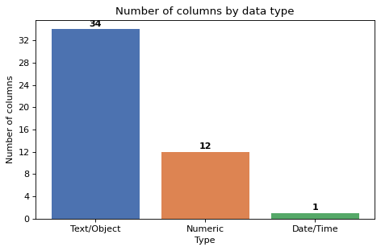

---

### 2. **Missing Values**
**Purpose**: Visualize the percentage of missing values in each column

**Visualization Output**:
- Horizontal bar chart: Percentage of null values per column with color-coded severity (red >50%, orange 20-50%, blue <20%)

**Output File**: `visualizations/Missing_Values_Percentage.png`
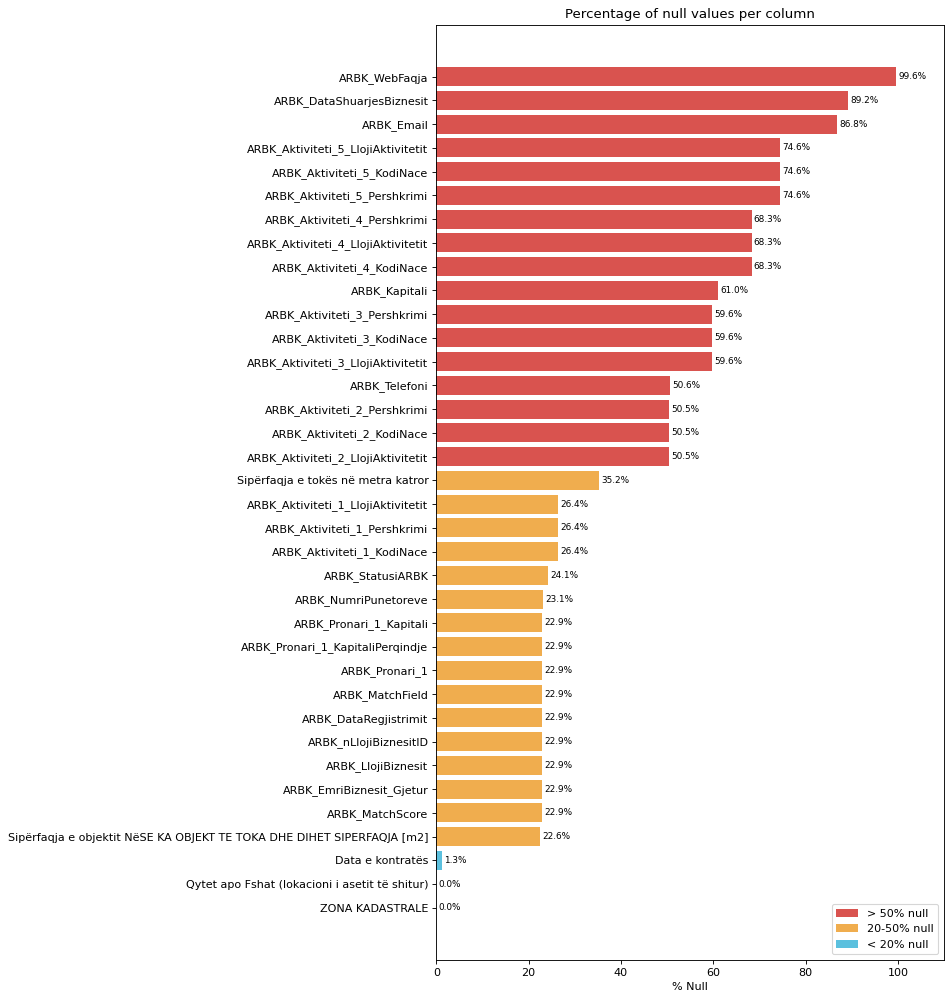

---

### 3. **ARBK Match Rate**
**Purpose**: Visualize the match rate between buyer names and ARBK business registry

**Visualization Output**:
- Pie chart: Percentage of records successfully matched vs. unmatched to ARBK database

**Output File**: `visualizations/ARBK_Match_Rate.png`
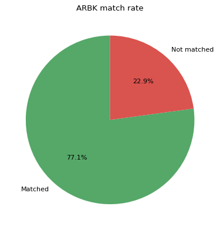

---


### 4. **Price plot**
**Purpose**: Visualize the plot of Price

**Visualization Output**:
- Bar chart: the Price of sold properties

**Output File**: `visualizations/Price_histogram_plot.png`
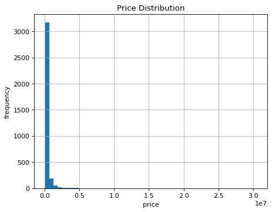
---
### 5. **Price plot logarithmic**
**Purpose**: Visualize the plot of Price

**Visualization Output**:
- Bar chart: the Price of sold properties logarithm applied

**Output File**: `visualizations/Price_histogram_plot_log.png`
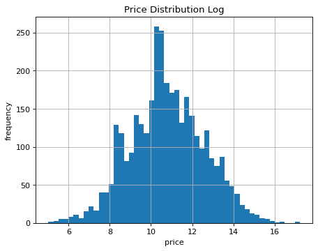
---
### 6. **land + built object in square meters histogram plot**
**Purpose**: Visualize the plot of land + built object in square meters

**Visualization Output**:
- Bar chart: the land square meters plus  the object built on top of the land square meters

**Output File**: `visualizations/land_and_object_histogram_plot.png`
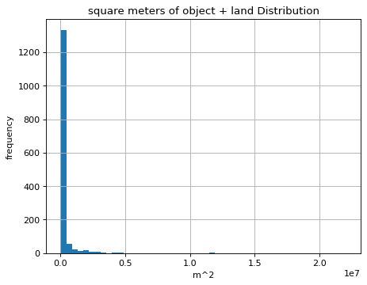
---
### 7. **land + built object in square meters histogram plot logarithmic**
**Purpose**: Visualize the plot of land + built object in square meters logarithm applied

**Visualization Output**:
- Bar chart: the land square meters plus  the object built on top of the land square meters

**Output File**: `visualizations/land_and_object_histogram_plot_log.png`
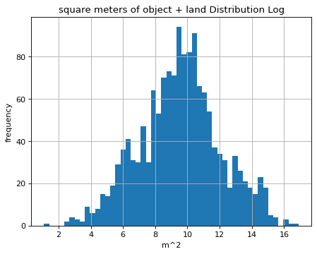
---
### 8. **outliers in sales price logarithmic**
**Purpose**: Visualize the outliers of the price column logarithmized

**Visualization Output**:
- BoxPlot: the boxplot of the outliers of price col

**Output File**: `visualizations/log_sale_price_outliers.png`
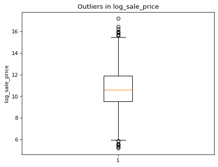
---


### Visualization Scripts Summary Table

| Script Name | Input | Output | Key Metric | Business Value |
|---|---|---|---|---|
| plot_missing_values.py | raw + cleaned data | PNG (1200×800) | Missing % per column | Data quality audit |
| plot_target_distribution.py | cleaned_dataset + train/test | PNG (1400×600) | Class balance | Model fairness check |
| plot_asset_structure_distribution.py | cleaned_dataset | PNG (1400×700) | Asset type % | Market composition |
| plot_price_distribution.py | cleaned_dataset | PNG (1600×900) | Price distribution shape | Normalization validation |
| plot_area_distribution.py | cleaned_dataset | PNG (1600×900) | Area statistics | Data quality check |
| plot_price_per_m2_distribution.py | cleaned_dataset | PNG (1600×900) | Unit pricing patterns | Location premium analysis |
| plot_correlation_heatmap.py | cleaned_dataset (numeric only) | PNG (1400×1400) | Correlation matrix | Multicollinearity check |
| plot_outlier_summary.py | cleaned_dataset + outlier flags | PNG (1600×900) | Outlier counts & rates | Data extremity analysis |
| plot_top_buyers.py | cleaned_dataset | PNG (1400×700) | Top buyer types | Market concentration |
| plot_feature_importance.py | trained model + dataset | PNG (1200×700) | Feature importance scores | Model interpretability |

---

## How to Run the Pipeline

### Prerequisites
- Python 3.8+
- Dependencies: pandas, numpy, scikit-learn, joblib, openpyxl
- Raw dataset: `sales_with_converted_rents_enriched_with_arbk.xlsx`

### Installation
```bash
# Install dependencies
pip install pandas numpy scikit-learn joblib openpyxl

# Or use requirements.txt (if provided)
pip install -r requirements.txt
```

### Running the Pipeline

#### Command Line
```bash
# From repository root
cd ../machineLearning-2026-Gr12

# Run the ETL pipeline
python -m src.property_buyer_pipeline.pipeline
```

### Configuration

Edit `src/property_buyer_pipeline/config.py` to customize:

```python
# Data paths
INPUT_FILE = "sales_with_converted_rents_enriched_with_arbk.xlsx"
OUTPUT_DIR = Path("data/processed/property_buyer")
MODELS_DIR = Path("data/raw/models/property_buyer")

# Quality thresholds
SPARSE_COL_THRESHOLD = 0.85  # Remove columns > 85% missing
DOMINANT_VALUE_THRESHOLD = 0.85  # Remove columns where 1 value > 85%


```

## Citation & Attribution

If you use this dataset or pipeline in research or publication, please reference:

```
Property Buyer Prediction Dataset & ETL Pipeline. 
Machine Learning Project (2026).
Repository: https://github.com/yourusername/machineLearning-2026-Gr12
```
---

# Phase 2 : Model Training, Analysis & Evaluation

## Overview

With the cleaned, feature-engineered dataset produced by Phase 1 (2,628 records, ~50 features, 8 buyer-profile classes), Phase 2 applies multiple machine learning algorithms — both **supervised** and **unsupervised** — to predict or discover `buyer_profile` patterns.

All models are trained on `data/processed/property_buyer/train_dataset_v1.0.xlsx` (2,102 rows, 80%) and evaluated on `data/processed/property_buyer/test_dataset_v1.0.xlsx` (526 rows, 20%). The four supervised models use **stratified 5-fold cross-validation** on the training set; the autoencoder uses **3-fold CV** because each fold retrains the entire network from scratch. Each model's artefacts (weights, metrics, predictions, visualizations) are persisted under `data/models/`.

### Target Variable

**`buyer_profile`** — 8-class categorical variable combining buyer entity type and economic sector:

| Class | Count (Train) | Description |
|---|---|---|
| `individual__commercial_services` | 1,072 | Individual buyers in commerce/services |
| `llc__commercial_services` | 390 | LLCs in commerce/services |
| `individual__industrial_ops` | 200 | Individual buyers in industrial operations |
| `llc__industrial_ops` | 171 | LLCs in industrial operations |
| `individual__unknown` | 106 | Individuals with unknown sector |
| `individual__primary` | 88 | Individuals in primary sector (agriculture) |
| `llc__primary` | 40 | LLCs in primary sector |
| `individual__public_social` | 35 | Individuals in public/social sector |

The class distribution is **imbalanced** (largest class is ~30× the smallest), which requires class-weighted loss functions and balanced metrics (macro F1, balanced accuracy) for fair evaluation.

### Evaluation Metrics

All supervised models report:
- **Accuracy** — overall fraction of correct predictions
- **Balanced Accuracy** — average of per-class recall (unaffected by class imbalance)
- **Macro F1** — unweighted average F1 across all 8 classes (primary metric)
- **Weighted F1** — F1 weighted by class support
- **Confusion Matrix** — full 8×8 prediction breakdown
- **Per-class Precision, Recall, F1** — detailed per-profile performance

---

## Supervised Algorithms

### 1. Random Forest

**Source**: `src/property_buyer_pipeline/train_random_forest.py`
**Output**: `data/models/property_buyer/random_forest_property/`

#### Algorithm Description

Random Forest is an **ensemble** of decision trees. Each tree is trained on a random bootstrap sample of the data using a random subset of features at each split. The final prediction is the majority vote across all trees. This reduces overfitting compared to a single decision tree and handles both numeric and categorical features naturally.

#### Configuration
- **Estimators**: 1,200 trees
- **Max Depth**: 24
- **Min Samples Split**: 6
- **Max Features**: 35% of features per split

#### Results

| Metric | 5-Fold CV (mean ± std) | Validation | Test |
|---|---|---|---|
| Accuracy | 83.07% ± 1.63% | 84.18% | 82.32% |
| Balanced Accuracy | 67.83% ± 3.70% | 67.54% | 67.62% |
| Macro F1 | 69.50% ± 3.57% | 70.33% | 68.70% |
| Weighted F1 | 82.86% ± 1.60% | 83.57% | 81.79% |

#### Analysis

Random Forest achieves solid baseline accuracy but lower balanced accuracy and macro F1, indicating it **struggles with minority classes** (e.g., `llc__primary`, `individual__public_social`).

#### Visualizations

**Confusion Matrix (Test Set)**
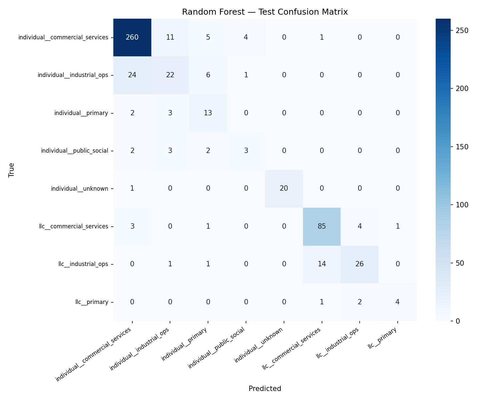

The confusion matrix reveals the model's main failure mode: it frequently confuses **industrial operations with commercial services** — 24 `individual__industrial_ops` samples were misclassified as `individual__commercial_services`, and 14 `llc__industrial_ops` samples as `llc__commercial_services`. 

**Per-Class F1 Score**
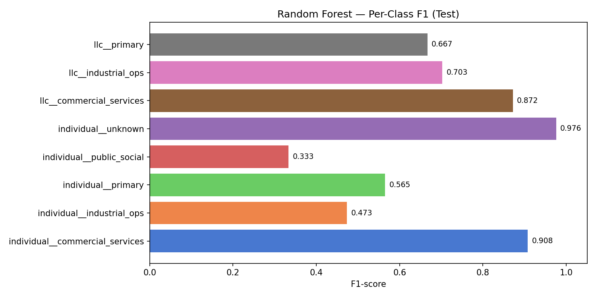

The F1 scores show a stark split: high-frequency classes (`individual__unknown` at 0.976, `individual__commercial_services` at 0.908) perform well, while minority classes suffer — `individual__public_social` achieves only 0.333 F1. This imbalance drives the large gap between overall accuracy (82%) and macro F1 (69%).

**Precision & Recall per Class**
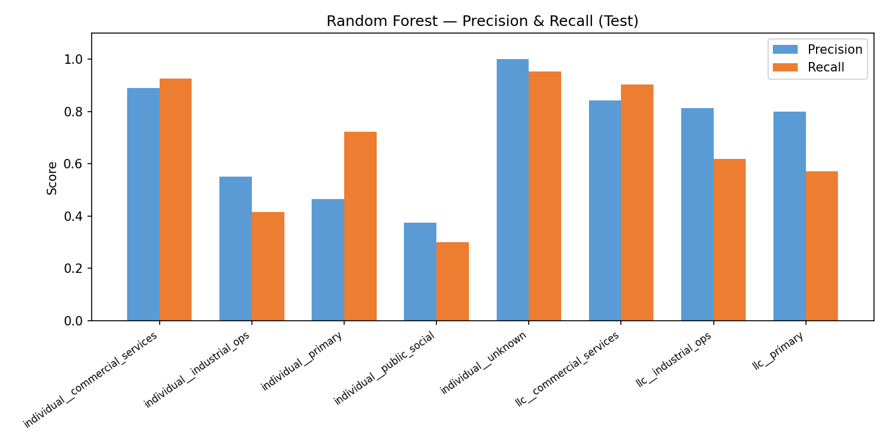

Precision and recall are uneven across classes. The model has high precision but low recall for several minority classes — it rarely predicts them, but when it does, it's often correct. `individual__public_social` has both low precision and recall, indicating the model largely ignores this class.

**Cross-Validation Fold Comparison**
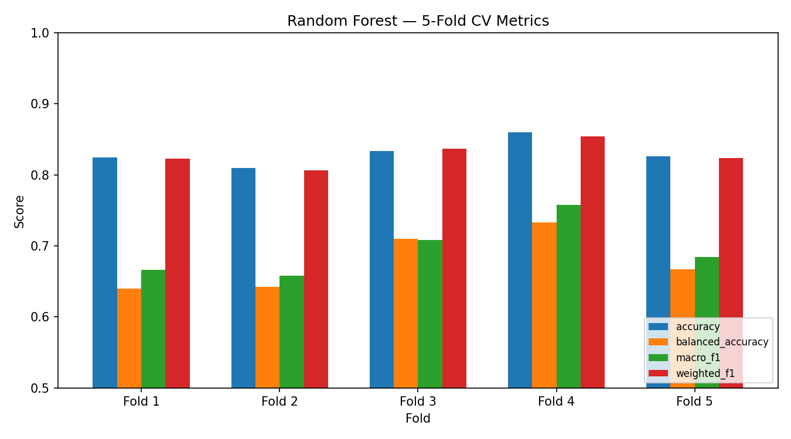

The 5-fold CV results are reasonably stable (accuracy ranges 81–86%), with `balanced_accuracy` showing the most variability (64–73%) across folds. This confirms that minority class performance is sensitive to which samples land in each fold.

**Validation vs Test**
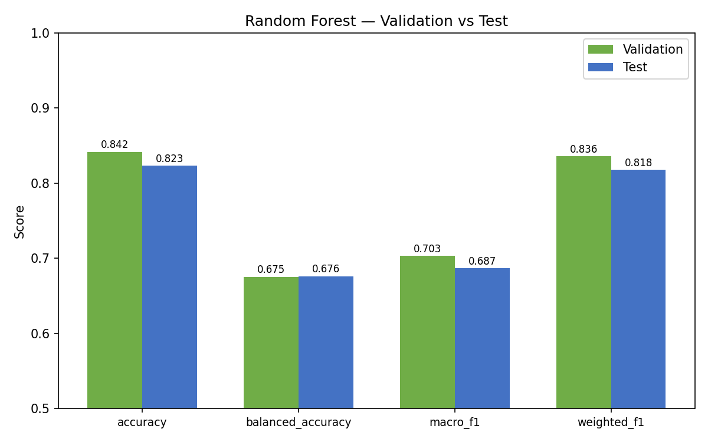

Validation and test metrics are closely aligned (within 2%), indicating the model generalizes consistently and is not overfitting to the validation set.

#### Architecture

Random Forest is an **ensemble of independent decision trees** trained in parallel. Each tree sees a different random view of the data (bagging + feature subsampling), and the forest's prediction is a majority vote across all trees.

```
Input:  features (e.g., area, price, time, quality flags, categorical codes)
       │
       ▼
 ┌─────────────────────────────────────────────────────┐
 │  Bootstrap sampling: draw N rows with replacement per tree          │
 │  Feature sampling: random 35% of features considered at each split  │
 └─────────────────────────────────────────────────────┘
       │
       ▼
 Tree 1        Tree 2        Tree 3       ...      Tree 1200
   │             │             │                      │
   ▼             ▼             ▼                      ▼
 (recursive splits on Gini impurity, max depth = 24, min split = 6)
   │             │             │                      │
 class prob.   class prob.   class prob.           class prob.
       │             │             │                      │
       └─────────────┴─────────────┬─────────────────────────┘
                             ▼
              Average probabilities across 1,200 trees
                             ▼
             Prediction: argmax → buyer_profile class
```

**Why it works**: individual trees are high-variance (they overfit), but averaging many decorrelated trees (via bagging + feature subsampling) cancels out their individual errors.

---

### 2. Logistic Regression

**Source**: `src/property_buyer_pipeline/train_linear.py`
**Output**: `data/models/property_buyer/logistic_regression_full_v1/`

#### Algorithm Description

Logistic Regression extends linear regression to classification by applying the **softmax function** to map linear combinations of features into class probabilities. For multiclass problems, it learns one set of weights per class. It is fast, interpretable, and works well when relationships between features and target are roughly linear.

The L2 (Ridge) regularization penalty prevents overfitting by shrinking coefficients toward zero, controlled by the `C` parameter (inverse regularization strength).

#### Configuration
- **Penalty**: L2 (Ridge)
- **C**: 1.0
- **Solver**: LBFGS (quasi-Newton method, efficient for multiclass)
- **Max Iterations**: 8,000

#### Results

| Metric | 5-Fold CV (mean ± std) | Validation | Test |
|---|---|---|---|
| Accuracy | 83.54% ± 1.92% | 85.76% | 83.27% |
| Balanced Accuracy | 78.88% ± 3.26% | 77.26% | 79.23% |
| Macro F1 | 73.75% ± 2.57% | 73.93% | 72.86% |
| Weighted F1 | 84.37% ± 1.68% | 86.19% | 83.94% |

#### Analysis

Logistic Regression performs slightly better than Random Forest in **balanced accuracy** (+11%) and **macro F1** (+4%) despite similar overall accuracy.  

#### Visualizations

**Confusion Matrix (Test Set)**
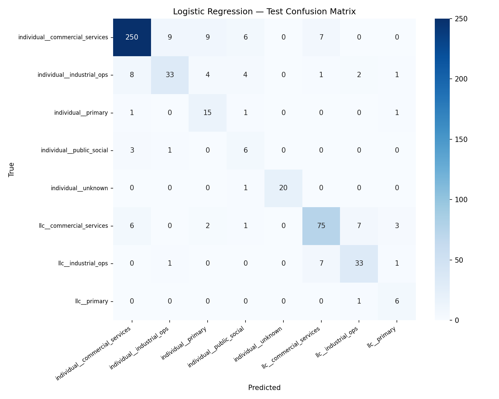

Compared to Random Forest, Logistic Regression produces a cleaner confusion matrix. The main misclassifications are: 9 `individual__commercial_services` predicted as `individual__industrial_ops`, and 7 `llc__industrial_ops` predicted as `llc__commercial_services`. 

**Per-Class F1 Score**
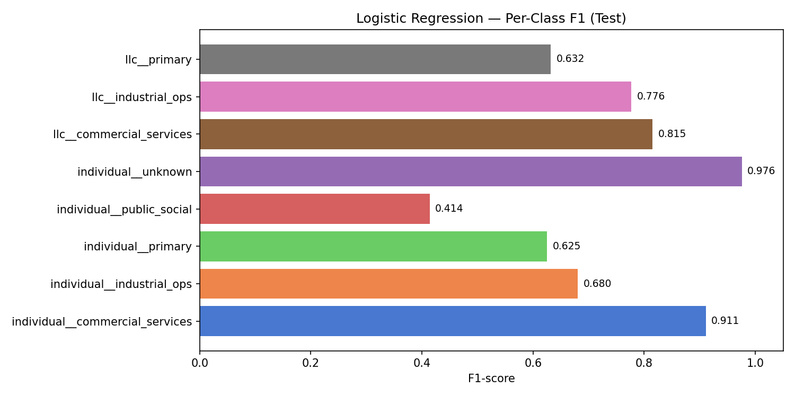


**Precision & Recall per Class**
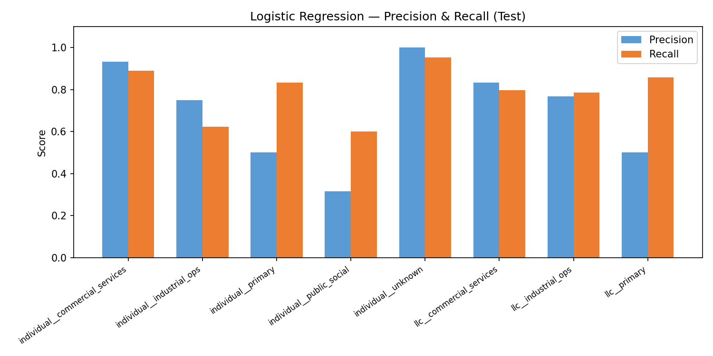

The precision-recall balance is more uniform than Random Forest. Most classes achieve >0.60 on both metrics.

**Cross-Validation Fold Comparison**
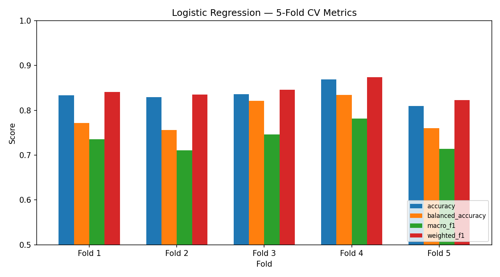

Fold-to-fold variation is moderate — accuracy spans 81–86% and macro F1 spans 71–77%. The linear model's simplicity provides stable estimates without the high variance sometimes seen in more complex models.

**Validation vs Test**
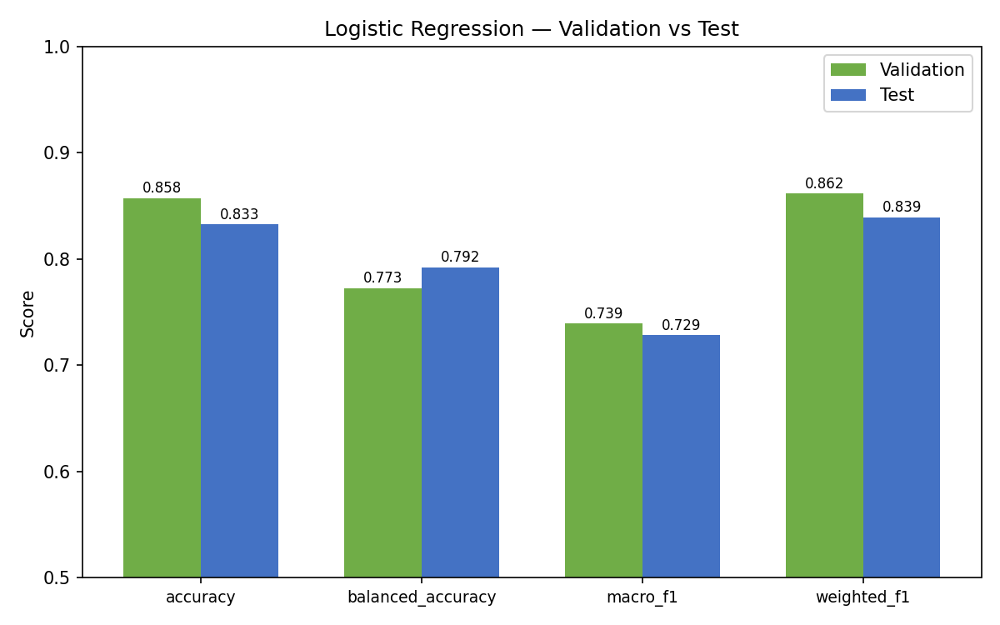

Validation and test scores are closely aligned. Balanced accuracy is slightly higher on the test set (79.2%) than validation (77.3%), suggesting the test split happens to contain slightly easier minority-class examples — a normal random effect at this sample size.

#### Architecture

Logistic Regression is a **single-layer linear model** with softmax output. For a K-class problem it learns one weight vector $w_k$ and bias $b_k$ per class. The softmax converts raw scores (logits) into a probability distribution over the 8 buyer profiles.

```
Input: 50 raw features 
       │
       ▼
 ┌────────────────────────────────────────────────┐
 │  Preprocessing                                           │
 │    • Numeric   → StandardScaler  (mean 0, std 1)          │
 │    • Categorical → OneHotEncoder (250+ activities, ...)   │
 └────────────────────────────────────────────────┘
       │
       ▼
  Transformed feature vector x (~438 dims after one-hot)
       │
       ▼
 ┌────────────────────────────────────────────────┐
 │  Linear scoring (8 class-weight vectors, one per profile)│
 │     z_k = w_k · x + b_k        for k = 1..8                │
 └────────────────────────────────────────────────┘
       │
       ▼
 ┌────────────────────────────────────────────────┐
 │  Softmax: p_k = exp(z_k) / Σ_j exp(z_j)                   │
 └────────────────────────────────────────────────┘
       │
       ▼
  Probabilities p_1..p_8  →  argmax → buyer_profile class

Training: minimize cross-entropy + L2 penalty (C = 1.0)
Solver: LBFGS (quasi-Newton) — up to 8,000 iterations
```

**Why it works**: if the boundary between classes is roughly linear in the transformed feature space, a single hyperplane per class is enough. The L2 penalty shrinks coefficients, keeping the 438-dim model from overfitting the 2,100-row training set. **Why it's limited**: it cannot capture non-linear interactions between features (e.g., "high capital AND commercial activity") unless those interactions are engineered manually.

---
### 3. CatBoost

**Source**: `src/property_buyer_pipeline/train_catboost.py`
**Output**: `data/models/property_buyer/catboost_full/`

#### Algorithm Description

CatBoost (Categorical Boosting) is a **gradient boosting** algorithm specifically designed for datasets with categorical features. Unlike Random Forest (which trains trees independently), gradient boosting trains trees **sequentially** — each new tree corrects the errors of all previous trees. CatBoost's key innovation is **ordered target encoding** for categorical features, which avoids the information leakage that occurs with standard target encoding.

The model uses class weights to handle the imbalanced target distribution and early stopping to prevent overfitting.

#### Configuration
- **Iterations**: 2,500 (max)
- **Learning Rate**: 0.03
- **Depth**: 7
- **L2 Regularization**: 9.0
- **Early Stopping**: 150 rounds without improvement
- **Best Iteration**: 181 (stopped early)

#### Results

| Metric | 5-Fold CV (mean ± std) | Validation | Test |
|---|---|---|---|
| Accuracy | 95.58% ± 0.86% | 96.20% | 95.63% |
| Balanced Accuracy | 94.48% ± 1.55% | 94.23% | 92.37% |
| Macro F1 | 91.93% ± 2.02% | 93.68% | 91.12% |
| Weighted F1 | 95.78% ± 0.72% | 96.24% | 95.84% |

#### Analysis

CatBoost is the **best-performing supervised model** across all metrics. It achieves 95.6% test accuracy and 91.1% macro F1, meaning it reliably identifies even rare buyer profiles. 

CatBoost's ability to natively handle the 244 unique business activity descriptions (without manual encoding) gives it a significant advantage over models that require one-hot encoding.

#### Visualizations

**Confusion Matrix (Test Set)**
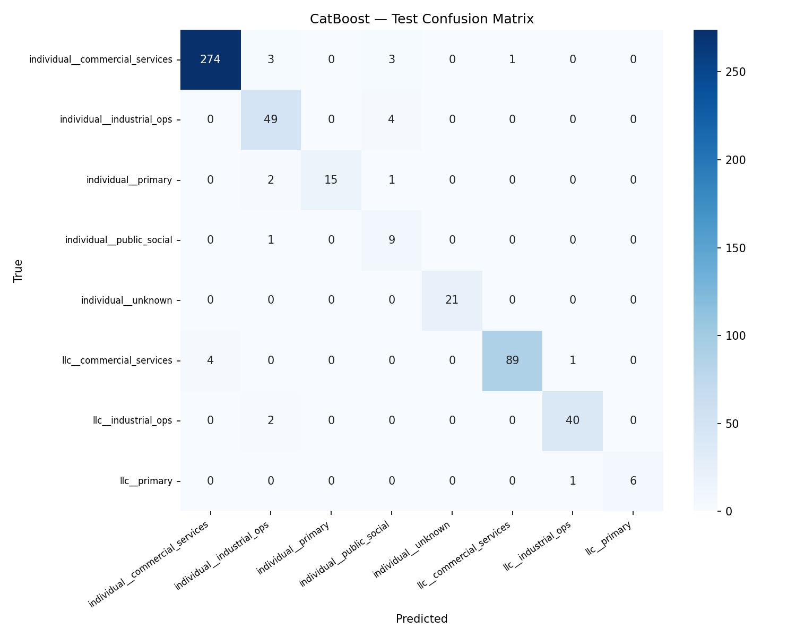

The confusion matrix is remarkably clean — the diagonal dominates almost every row. The largest off-diagonal values are only 3–4 samples. `individual__unknown` has zero misclassifications (perfect 1.000 F1). The model correctly separates LLC from individual buyers and accurately distinguishes industrial from commercial sectors.

**Per-Class F1 Score**
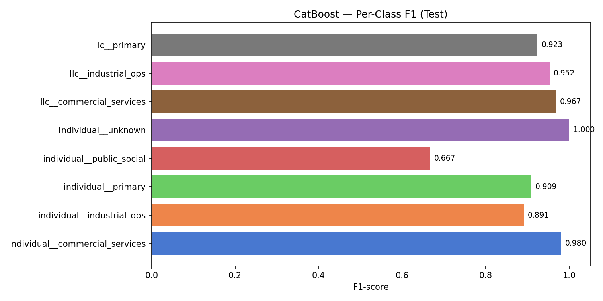

Seven of eight classes achieve F1 > 0.89. Even traditionally difficult classes like `llc__primary` (only 7 test samples) reach 0.923 F1. The only class below 0.70 is `individual__public_social` (0.667), which has only 10 test samples — a sample size too small for reliable per-class estimates.

**Precision & Recall per Class**
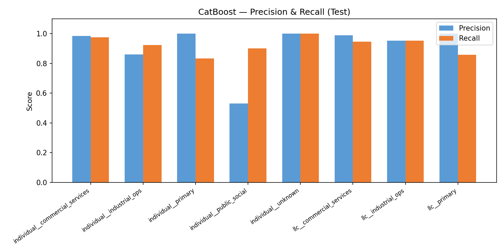

Precision and recall are well-balanced across nearly all classes, with no class showing extreme precision-recall trade-offs. This indicates the model's class-weight mechanism effectively prevents it from sacrificing minority-class recall for majority-class precision.

**Cross-Validation Fold Comparison**
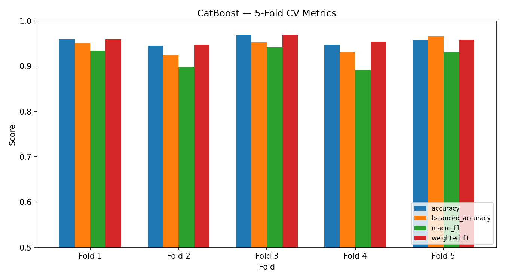

All 5 folds achieve accuracy above 94.5% and macro F1 above 88%. The low standard deviation across folds (accuracy ± 0.86%) confirms that CatBoost's performance is stable and not dependent on a particular data split.

**Validation vs Test**
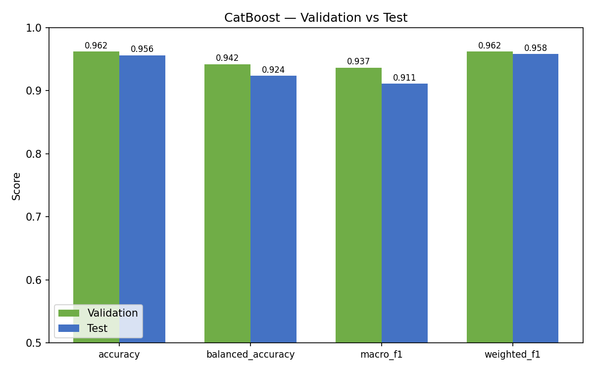

Validation and test metrics are nearly identical (within 1–2%), demonstrating excellent generalization. The slight drop from validation to test balanced accuracy (94.2% → 92.4%) is within the expected range of random variation.

#### Architecture

CatBoost is a **sequential ensemble of shallow decision trees** (gradient boosting). Unlike Random Forest, each new tree is trained to correct the residual errors of the ensemble built so far. Categorical features are handled natively via **ordered target statistics**, so no one-hot encoding is needed.

```
Input: 50 raw features  (11 categorical marked as cat_features — NO one-hot)
       │
       ▼
 ┌─────────────────────────────────────────────────────┐
 │  Ordered target encoding for cat features (avoids leakage):  │
 │  each category → running mean of target on prior rows          │
 └─────────────────────────────────────────────────────┘
       │
       ▼
  F_0(x) = base prediction (class priors)
       │
       ▼                                   ◀── iterate up to 2,500 rounds
 ┌─────────────────────────────────────────────────────┐
 │  Round t:                                                    │
 │    1. Compute pseudo-residuals r_t = ∂L / ∂F_{t-1}            │
 │    2. Fit oblivious tree h_t (depth 7) to r_t                 │
 │    3. F_t = F_{t-1} + η · h_t       (learning rate η = 0.03)  │
 │    4. L2 leaf regularization (λ = 9.0) shrinks leaf values    │
 └─────────────────────────────────────────────────────┘
       │
       ▼
  Early stopping triggers at iteration 181 (no val-loss improvement
  for 150 rounds) → final ensemble = F_181 = sum of 181 trees
       │
       ▼
  Softmax over per-class scores → buyer_profile prediction
```

**Why it works**: gradient boosting builds a powerful non-linear model by stacking many **weak learners** (shallow trees), each specializing on the mistakes of the previous ones. The combination of small learning rate, shallow trees, L2 leaf regularization, and early stopping keeps the model from overfitting even on only ~2,000 training rows.


---

### 4. Neural Network (Feedforward with Entity Embeddings)

**Source**: `src/ml/neural_net/train_neural_net.py`
**Output**: `data/models/neural_net/`

#### Algorithm Description

A feedforward neural network learns a non-linear mapping from input features to output classes through multiple layers of weighted transformations. Each layer applies: (1) a **linear transformation** ($y = Wx + b$), (2) **batch normalization** for training stability, (3) a **ReLU activation** ($f(x) = \max(0, x)$) for non-linearity, and (4) **dropout** (randomly zeroing neurons) to prevent overfitting.

The key design choice for this dataset is **entity embeddings**: instead of one-hot encoding the 11 categorical features (which would create 1,000+ sparse columns), each category is mapped to a compact learned vector. For example, `zona_kadastrale` gets a 50-dimensional embedding — the network learns that geographically similar zones should have similar vectors.

**Class-weighted cross-entropy loss** penalizes errors on rare classes more heavily, and **early stopping** monitors validation loss to halt training before overfitting occurs.

#### Architecture
```
Input: 11 categorical features (→ entity embeddings) + 41 numeric features (→ StandardScaler)
       ↓
Embedding Layer: 11 embedding tables, total ~200 dimensions
       ↓ concatenate with 41 scaled numeric features
Hidden Layer 1: 256 neurons + BatchNorm + ReLU + Dropout(0.3)
       ↓
Hidden Layer 2: 128 neurons + BatchNorm + ReLU + Dropout(0.3)
       ↓
Hidden Layer 3: 64 neurons + BatchNorm + ReLU + Dropout(0.3)
       ↓
Output Layer: 8 neurons (one per buyer profile class)
       ↓ argmax
Prediction: buyer_profile class

Total parameters: 193,402
```

#### Configuration
- **Framework**: PyTorch
- **Optimizer**: Adam (lr=0.001, weight_decay=1e-4)
- **Batch Size**: 64
- **Max Epochs**: 200
- **Early Stopping Patience**: 20 epochs
- **Best Epoch**: 17 (validation loss = 0.4185, then monotonically increased)
- **Validation Split**: 15% of training data

#### Results

| Metric | 5-Fold CV (mean ± std) | Validation | Test |
|---|---|---|---|
| Accuracy | 92.82% ± 1.67% | 90.19% | 88.59% |
| Balanced Accuracy | 89.14% ± 3.12% | 84.98% | 83.00% |
| Macro F1 | 90.04% ± 2.86% | 83.38% | 82.71% |
| Weighted F1 | 92.77% ± 1.69% | 90.41% | 88.39% |

#### Analysis

The neural network is the **second-best model** after CatBoost. Its entity embeddings successfully capture relationships between high-cardinality categorical features. The training loss curve shows clear convergence with overfitting beginning at epoch 17 — the early stopping mechanism correctly saved the best weights from that epoch.

The gap between CV macro F1 (90.0%) and test macro F1 (82.7%) suggests some degree of sensitivity to the specific data split, though the model generalizes well overall.

#### Visualizations

**Training & Validation Loss Curve**
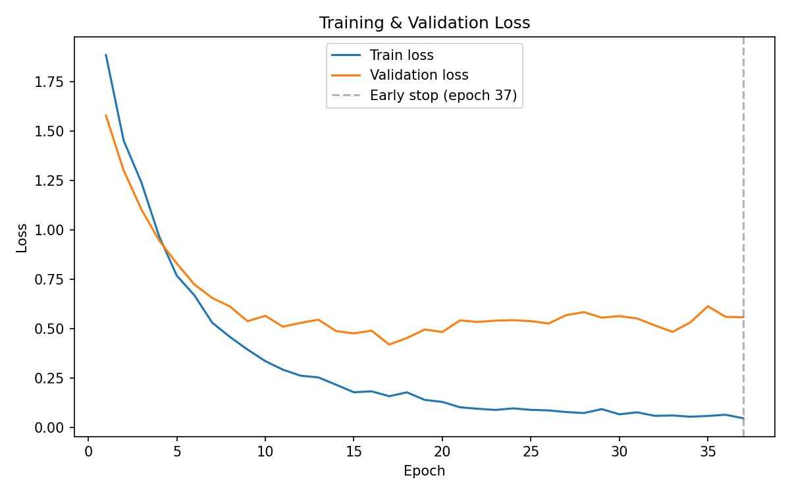

The loss curve shows two distinct phases: **learning** (epochs 1–17) where both train and validation loss decrease rapidly, and **overfitting** (epochs 18–37) where training loss continues to drop while validation loss increases. The best model weights were saved at epoch 17 (validation loss = 0.4185). The growing gap between train and validation loss after epoch 17 is a textbook example of neural network overfitting — the model begins memorizing training examples rather than learning generalizable patterns.

**Confusion Matrix (Test Set)**


The dominant misclassification pattern is `individual__industrial_ops` being confused with `individual__commercial_services` (16 errors). This same confusion occurs in the LLC categories too (5 `llc__industrial_ops` → `llc__commercial_services`). The entity embeddings help distinguish entity types (individual vs. LLC) but still struggle to separate economic sectors when the features are similar.

**Per-Class F1 Score**
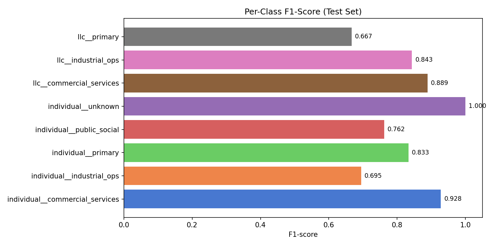

The neural network achieves perfect F1 (1.000) on `individual__unknown` and strong scores on `individual__primary` (0.833) and `llc__industrial_ops` (0.843). The weakest classes are `llc__primary` (0.667) and `individual__industrial_ops` (0.695), both of which are mid-frequency classes where the model has enough data to learn but insufficient signal to separate from larger classes.

**Precision & Recall per Class**
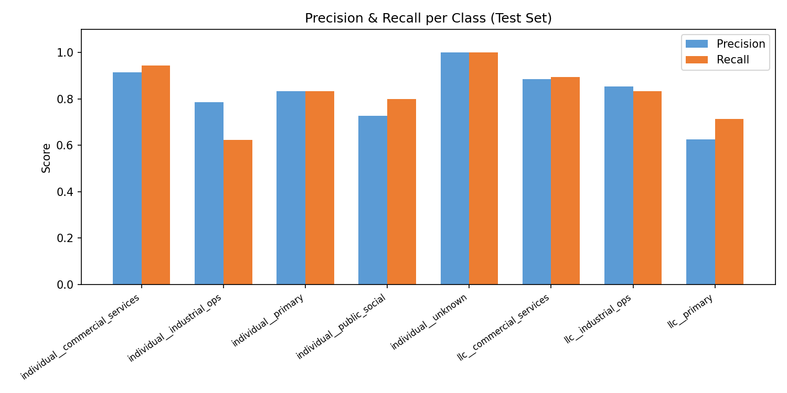

The precision-recall trade-offs vary by class: `individual__industrial_ops` has much higher precision than recall, meaning the model correctly identifies most of the cases it labels as this class but misses many actual instances. Conversely, `individual__primary` has high recall but lower precision.

**Cross-Validation Fold Comparison**
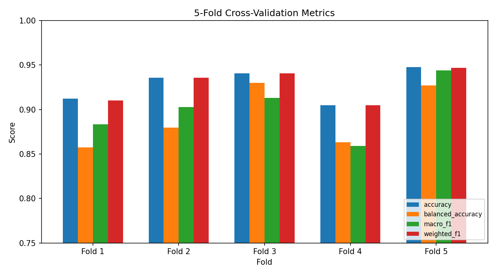

The 5-fold CV shows meaningful variability — macro F1 ranges from 0.859 (Fold 4) to 0.944 (Fold 5). This ~8.5% spread is larger than CatBoost's (~5.5%), reflecting the neural network's higher sensitivity to data splits. The variance is partly because each fold trains from a random initialization, introducing non-deterministic variation.

**Validation vs Test**
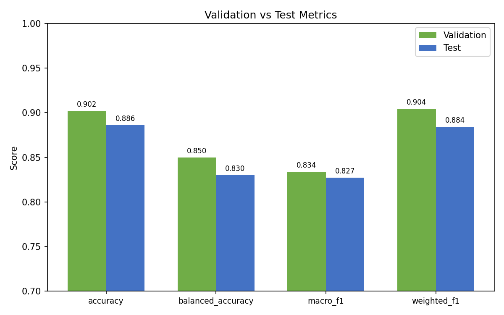

There is a noticeable gap between validation macro F1 (83.4%) and test macro F1 (82.7%), both lower than the CV average (90.0%). This gap between CV and holdout performance suggests the neural network benefits from the larger effective training sets in CV (80% × 2102 = 1682 per fold) compared to the final model's training subset (85% × 2102 = 1787 minus the validation split).


---

## Unsupervised Algorithms

### 5. KMeans Clustering

**Source**: `src/property_buyer_pipeline/train_kmeans.py`
**Output**: `data/models/property_buyer/kmeans_full_v1/`

#### Algorithm Description

KMeans is an **unsupervised** algorithm that partitions the dataset into *k* groups (clusters) by iteratively:
1. Assigning each data point to the nearest cluster centroid
2. Recomputing centroids as the mean of all points in each cluster

Unlike supervised models, KMeans has **no access to the target labels** during training. It discovers structure purely from feature similarity. The goal is to evaluate whether natural groupings in the data align with the known buyer profiles.

Two metrics guide the selection of *k*:
- **Elbow Method** (inertia): measures within-cluster compactness — look for the "elbow" where adding more clusters yields diminishing returns
- **Silhouette Score**: measures how similar each point is to its own cluster vs. neighboring clusters (range: -1 to 1, higher is better)

#### Configuration
- **k range evaluated**: 3–10
- **Selected k**: 5 (highest silhouette score)
- **n_init**: 20 (random restarts to avoid local minima)
- **Max Iterations**: 500
- **Features**: 50 features (11 categorical one-hot encoded → 438 transformed features)

#### Results

| Metric | Value |
|---|---|
| Silhouette Score | 0.188 |
| Calinski-Harabasz Score | 272.53 |
| Davies-Bouldin Score | 1.89 |
| Inertia | 87,687 |

#### Analysis

The low silhouette score (0.188) indicates that the clusters are **not well-separated** — data points are often roughly equidistant between cluster boundaries. This is expected because:
1. The buyer profiles are defined by **business-type semantics** (LLC vs. individual, sector), not geometric distance in feature space
2. One-hot encoding of 250+ business activities creates a very high-dimensional sparse space where distance-based clustering is less effective
3. The dominant cluster pattern reflects **price/area scales** rather than buyer-type distinctions

The cluster-to-profile heatmap confirms that most clusters are dominated by `individual__commercial_services` (the majority class), with limited separation between profiles. This validates the choice of supervised methods as the primary prediction approach.

#### Visualizations

**Cluster Selection: Elbow & Silhouette**
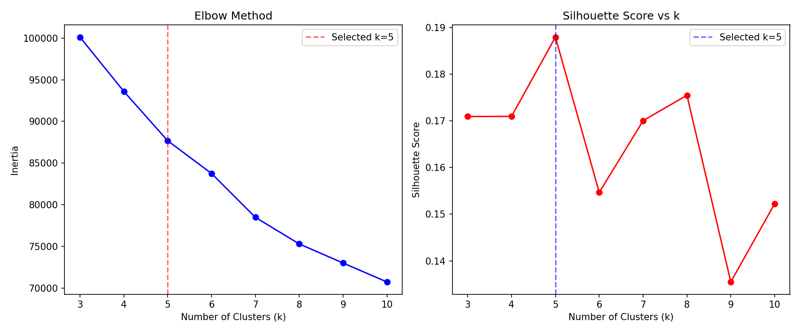

The left plot (Elbow Method) shows inertia decreasing steadily from k=3 to k=10 with no sharp "elbow" — indicating there is no clearly optimal number of clusters in this dataset. The right plot (Silhouette Score) shows k=5 achieves the highest silhouette score (0.188), though all values remain below 0.20, indicating weak cluster structure overall. The flatness of both curves suggests the data does not contain well-defined natural groupings.

**Cluster Sizes**
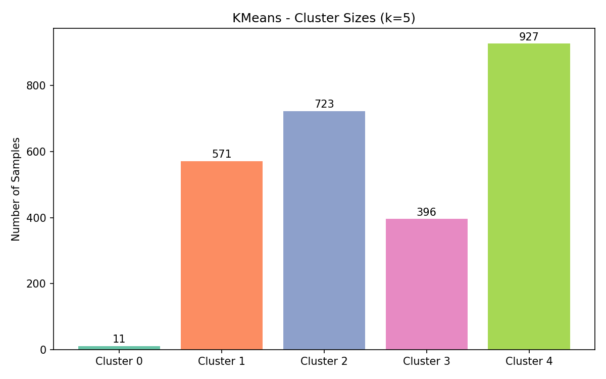

The 5 clusters are highly uneven: Cluster 2 (723 samples) and Cluster 1 (571 samples) dominate, while Cluster 0 contains only 11 samples. This extreme imbalance suggests Cluster 0 captures a small set of outliers (likely high-capital LLCs), while the large clusters blend multiple buyer profiles together.

**Buyer Profile Distribution per Cluster**
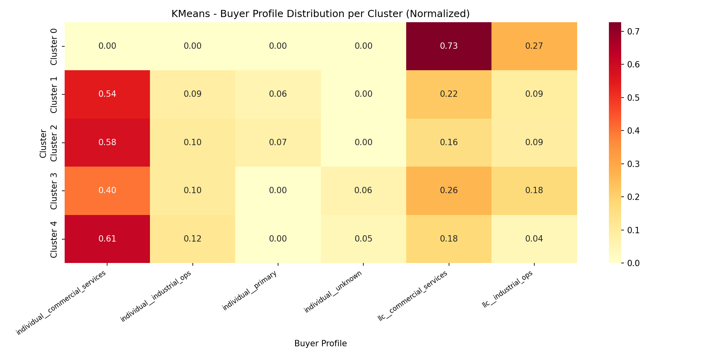

The heatmap confirms that clusters do not map cleanly to buyer profiles. Every large cluster (1–4) is dominated by `individual__commercial_services` (the majority class), with 40–51% representation. No cluster achieves strong purity for any minority class. Only Cluster 0 (11 samples) is dominated by `llc__commercial_services` at 73%, but this cluster is too small to be useful. This validates that buyer profiles are defined by **business semantics** rather than the feature-space geometry that KMeans relies on.

#### Architecture

KMeans is an **iterative geometric partitioning algorithm**. It repeatedly alternates between assigning points to their nearest centroid and moving each centroid to the mean of its assigned points, minimizing the total squared distance (inertia) between points and their cluster centers.

```
Input: 50 raw features (11 categorical → OneHotEncoded → ~438 transformed dims)
       │
       ▼
 ┌────────────────────────────────────────────────┐
 │ Preprocessing                                           │
 │   • Numeric    → StandardScaler (mean 0, std 1)         │
 │   • Categorical → OneHotEncoder                          │
 └─────────────────────────────────────────────────┘
       │                      ◀── try k ∈ {3, 4, 5, ..., 10}
       ▼                           select k with highest silhouette
 ┌─────────────────────────────────────────────────┐
 │ For k = 5 (selected):                                   │
 │   Repeat 20 times with different random seeds (n_init): │
 │                                                         │
 │   1. Init centroids μ_1 .. μ_5 (k-means++ seeding)       │
 │   2. ASSIGN:   c_i = argmin_k || x_i − μ_k ||²            │
 │   3. UPDATE:   μ_k = mean of all x_i with c_i = k         │
 │   4. Repeat 2–3 until assignments stable (max 500 iters) │
 │                                                         │
 │   Keep the run with lowest inertia.                     │
 └──────────────────────────────────────────────────┘
       │
       ▼
  5 centroids + cluster label c_i ∈ {0..4} for every point
       │
       ▼
  Evaluation (no training labels used):
    • Silhouette score   (cohesion vs. separation)
    • Calinski-Harabasz (between- vs. within-cluster variance)
    • Davies-Bouldin    (average cluster similarity)
    • Cluster × buyer_profile contingency heatmap (post-hoc)
```

**Why it works on some datasets**: when clusters are roughly spherical and well-separated in Euclidean space, the iterative assign/update loop converges to meaningful groupings. **Why it doesn't work well here**: buyer profiles are defined by **categorical semantics** (entity type, business sector), which one-hot encoding spreads across hundreds of sparse binary dimensions. Euclidean distance in that space mostly reflects property price/area scale rather than buyer identity — so the geometry KMeans optimizes doesn't align with the semantic grouping we care about.

---

### 6. Autoencoder (Unsupervised Neural Network)

**Source**: `src/ml/autoencoder_buyer/train_autoencoder.py`
**Output**: `data/models/autoencoder/`

#### Algorithm Description

An **autoencoder** is an unsupervised neural network that learns to compress each input row into a small **latent vector** and then reconstruct the original row from that vector. Because the bottleneck is narrower than the input, the network is forced to discover a compact representation that captures the most informative structure in the data.

Key points for this dataset:

- **Entity embeddings** handle the 11 high-cardinality categorical features (same trick as the supervised neural network): each category is mapped to a dense learnable vector rather than a one-hot column.
- **Mixed reconstruction loss** — the decoder has two heads: an MSE head that predicts the 41 scaled numeric features, and 11 softmax heads that predict each categorical column. Total loss = MSE(numeric) + mean cross-entropy(categorical).
- **No labels are used during training.** The `buyer_profile` column is only consulted after training to score how useful the learned latent space is.

After training we evaluate the latent space in two label-aware ways (labels used only for scoring):

1. **KMeans clustering on the latent space** — do natural clusters in the 8-D latent space correspond to buyer profiles? Scored with silhouette, plus **ARI** and **NMI** against the true labels.
2. **k-NN classification in the latent space** — if we do a nearest-neighbor vote using the learned latent vectors, how well can we predict `buyer_profile` on the test set?

#### Architecture

The network is symmetric: the decoder mirrors the encoder, and a small latent bottleneck sits in the middle.

```
Input:  11 categorical (entity embeddings) + 41 numeric (StandardScaler)
        │
        ▼
  Embedding layer (≥11 tables, ~196 dims) ⊕ 41 numeric  →  ~237 dims
        │
        ▼
  ┌────────────────────────────────┐
  │ ENCODER                            │
  │ FC 128 + BN + ReLU + Dropout(0.1) │
  │ FC  64 + BN + ReLU + Dropout(0.1) │
  │ FC   8  ← LATENT BOTTLENECK        │
  └─────────────────────────────────┘
        │
        ▼           z = latent vector (8 dims)
  ┌────────────────────────────────┐
  │ DECODER                            │
  │ FC  64 + BN + ReLU + Dropout(0.1) │
  │ FC 128 + BN + ReLU + Dropout(0.1) │
  └─────────────────────────────────┘
        │
  ────┼───────────────────────────────────
  │   │   11 softmax heads  →  reconstruct categorical columns
  │   └───────────────────────────────────
  │            1 linear head      →  reconstruct 41 numeric features

Loss = MSE(numeric) + mean_i CE(categorical_i)
Total parameters: 311,100
```

#### Configuration
- **Framework**: PyTorch
- **Optimizer**: Adam (lr=1e-3, weight_decay=1e-5)
- **Batch size**: 64
- **Max epochs**: 200 | **Early-stopping patience**: 25 epochs (on validation reconstruction loss)
- **Best epoch**: 70 (validation loss = 1.652) — training stopped at epoch 95
- **Latent dimension**: 8
- **Post-hoc eval**: KMeans (k=8, matches number of buyer profiles), k-NN (k=5, distance-weighted)

#### Results

**Clustering on the learned latent space** (k=8):

| Metric | Value | Compare to raw-feature KMeans |
|---|---|---|
| Silhouette | 0.151 | 0.188 |
| Calinski-Harabasz | 202.9 | 272.5 |
| Davies-Bouldin | 1.73 | 1.89 |
| **ARI vs buyer_profile** | **0.052** | n/a |
| **NMI vs buyer_profile** | **0.080** | n/a |

**k-NN classification in the latent space** (labels are only used at eval):

| Metric | Value |
|---|---|
| Accuracy | 62.7% |
| Balanced accuracy | 33.6% |
| Macro F1 | 0.363 |
| Weighted F1 | — |

#### Analysis

The loss curve shows the autoencoder successfully learns to compress-and-reconstruct the data — validation loss drops from 3.4 to 1.65 and then plateaus, with early stopping engaging at epoch 95.

The label-aware evaluations confirm what KMeans already told us in the previous section: **the geometry of this dataset does not encode buyer-profile identity**.

- **ARI = 0.052 and NMI = 0.080** are both close to zero, meaning the KMeans clusters on the latent space barely agree better than random chance with the true buyer profiles.
- **Latent k-NN balanced accuracy is 33.6%** — it can latch onto the two dominant classes (`individual__commercial_services`, `individual__unknown`) but fails on minority ones.
- Both results are *worse* than the supervised models in every category, but **that is the expected finding**, not a failure. An autoencoder that never sees labels cannot be expected to beat a model that trains directly on them.

The useful conclusion is the **direction of the gap**: the 55-point drop from supervised CatBoost (91% macro F1) to the autoencoder+kNN pipeline (36% macro F1) quantifies how much of the signal in this dataset lives specifically in the label-conditional information — information that unsupervised objectives cannot recover on their own.

#### Visualizations

**Training & Validation Reconstruction Loss**
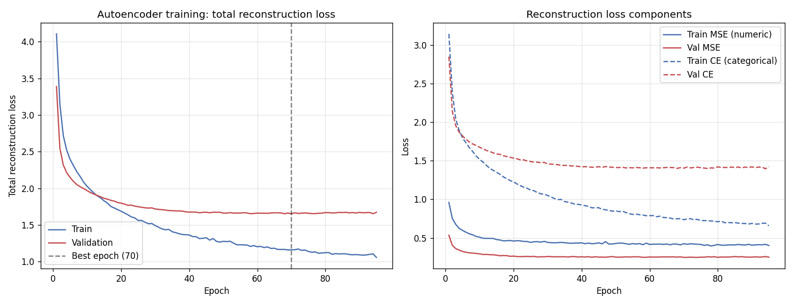

The left panel shows the total reconstruction loss decreasing steadily from ~4.1 to ~1.65 over ~70 epochs, then plateauing. The right panel breaks this into its two components: the numeric **MSE** converges quickly to ~0.25, while the **categorical cross-entropy** does most of the work of the total loss (~1.4 plateau) 

**Latent Space (PCA) colored by buyer_profile**
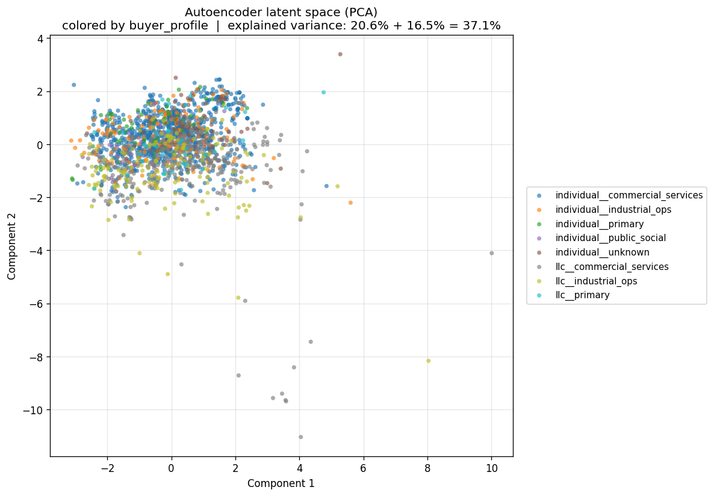

Projecting the 8-D latent space to 2-D via PCA shows that the first two components explain most of the variance, but the buyer-profile classes are **heavily overlapping** in this view. 

**Latent Space (t-SNE) colored by buyer_profile**
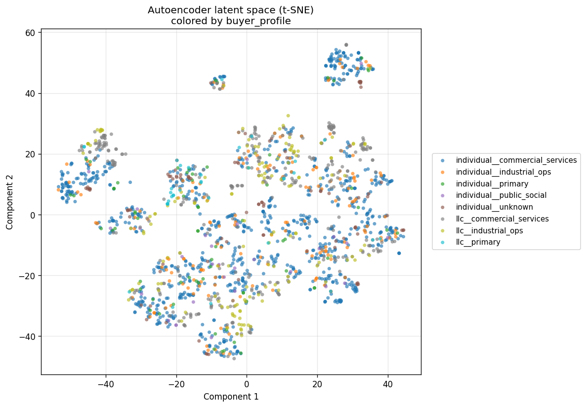

t-SNE (a non-linear projection) gives the autoencoder the fairest possible chance to show class structure. 

**Latent Space (PCA) colored by KMeans cluster**
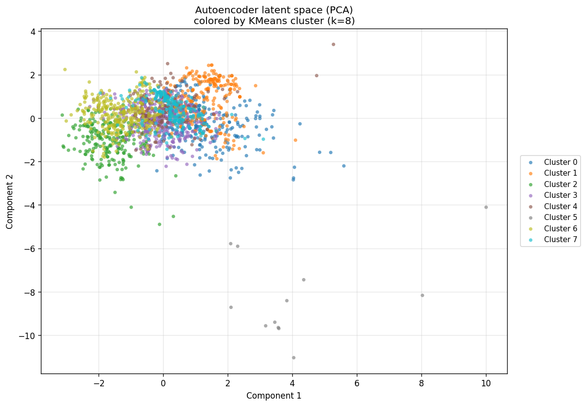

Coloring the same PCA projection by KMeans cluster (k=8) confirms that KMeans does find geometrically coherent regions in the latent space — the colors are spatially contiguous. The problem is not that the clustering is broken; the problem is that these geometric regions don't match the semantic buyer-profile boundaries.

**Cluster × Buyer-Profile Heatmap**
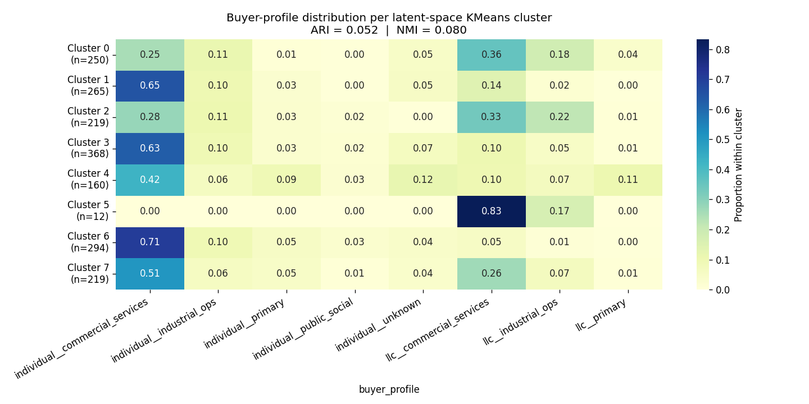

---

## Model Comparison Summary

| Algorithm | Type | Accuracy | Balanced Acc. | Macro F1 | Weighted F1 |
|---|---|---|---|---|---|
| **CatBoost** | Supervised (Boosting) | **95.63%** | **92.37%** | **91.12%** | **95.84%** |
| **Neural Network** | Supervised (Deep Learning) | 88.59% | 83.00% | 82.71% | 88.39% |
| **Logistic Regression** | Supervised (Linear) | 83.27% | 79.23% | 72.86% | 83.94% |
| **Random Forest** | Supervised (Ensemble) | 82.32% | 67.62% | 68.70% | 81.79% |
| **Autoencoder** | Unsupervised (Deep Learning) | 62.74% | 33.58% | 36.25% | 58.82% |
| **KMeans** | Unsupervised (Clustering) | — | — | — | — |


### Key Findings

1. **CatBoost is the clear winner** with 95.6% accuracy and 91.1% macro F1 — its native handling of high-cardinality categorical features (especially `arbk_aktiviteti_1_pershkrimi`) gives it a decisive advantage.

2. **The Neural Network performs second-best** (82.7% macro F1), demonstrating that entity embeddings can learn meaningful representations of categorical features, but require more careful tuning and larger datasets to match gradient boosting.

3. **Linear models provide a strong baseline.** Logistic Regression achieves 72.9% macro F1 with full interpretability — useful for understanding feature contributions.

4. **Unsupervised methods agree: supervision is needed here.** Both KMeans on raw features and the autoencoder's learned 8-D latent space fail to recover buyer-profile identity (autoencoder + KMeans ARI = 0.052, NMI = 0.080). This confirms that the buyer profile is defined by label-conditional semantics, not by feature-space geometry.

---

## Discussion

Having trained six algorithms on the same dataset (four supervised, two unsupervised), we can now compare them side-by-side and draw conclusions about what worked, what didn't, and **why**. This section turns the per-model results into a cross-model narrative with five comparison visualizations.

### Overall Metrics at a Glance

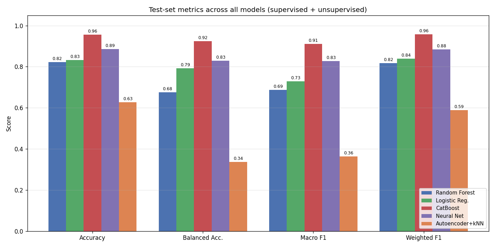

This grouped bar chart overlays the four main test-set metrics (accuracy, balanced accuracy, macro F1, weighted F1) for every model — the four supervised algorithms and the unsupervised **Autoencoder + kNN** baseline. A few patterns jump out immediately:

- **CatBoost dominates every metric** by a wide margin (~7 percentage points over the runner-up). Crucially, its *balanced* accuracy (92.4%) is only ~3 points below its raw accuracy (95.6%) — meaning it treats minority classes almost as well as majority ones.
- **Random Forest shows the largest gap between accuracy and balanced accuracy** (82.3% vs. 67.6%, a 14.7-point gap). This is the classic signature of a model that scores well by over-predicting the majority class.
- **Logistic Regression outperforms Random Forest on every metric except raw accuracy**, thanks to its explicit class-weight parameter which offsets the imbalance better than Random Forest's bagging does.
- **Neural Network sits comfortably in second place**, confirming that entity embeddings on categorical features are competitive with tree-based methods, though still a step behind CatBoost for this sample size.
- **Autoencoder + kNN is the lowest bar on every metric except raw accuracy**, where it reaches 62.7% by riding the majority class. Its balanced accuracy collapses to 33.6% and macro F1 to 36.2% — direct evidence that a representation optimised for *reconstruction* rather than *classification* loses roughly half of the label-conditional signal.

### Where the Performance Gap Actually Comes From

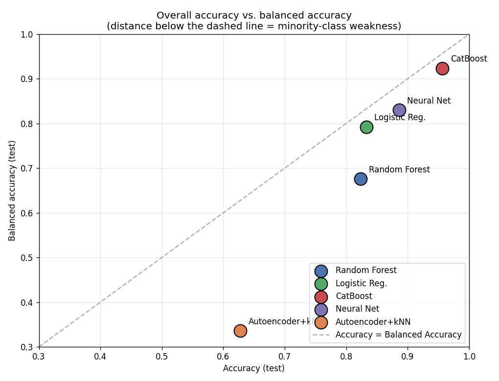

Plotting accuracy against balanced accuracy makes the class-imbalance story visual. The dashed diagonal is the "fair" line where both metrics are equal — models sitting on it handle all classes equally well. **Distance below the line = minority-class weakness.**

- CatBoost sits closest to the diagonal (small gap) — its class weighting + native categorical handling lets it learn all 8 classes well.
- Neural Network is also close to the diagonal, with a similar accuracy/balanced gap (~5.6 points) coming from just a handful of misclassified minority-class samples.
- Logistic Regression is well above the diagonal (accuracy > balanced), meaning it actually performs *better* on minority classes than a naïve accuracy interpretation suggests — its explicit class-weight parameter offsets the imbalance.
- Random Forest is the farthest below — the accuracy/balanced gap is a red flag that the model is largely coasting on the majority class.


### Stability Across Folds: Can We Trust These Numbers?

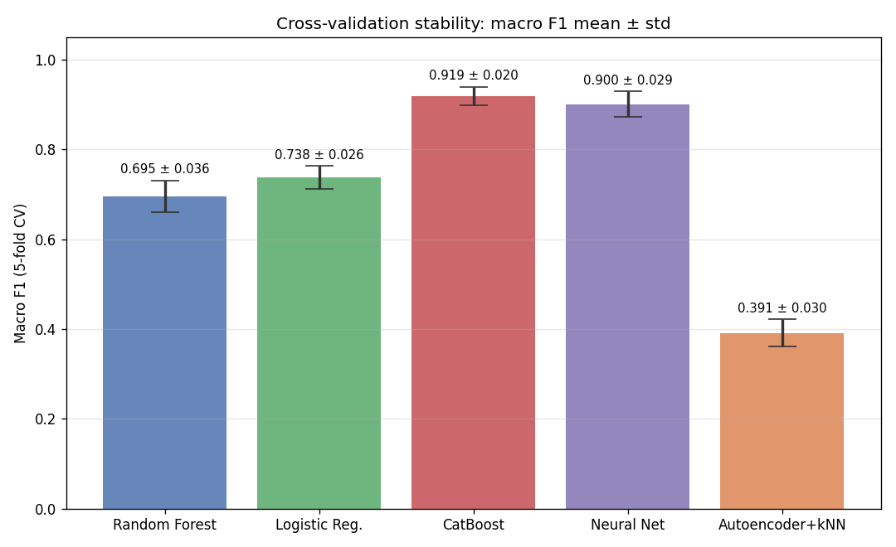

Average performance is only half the story — we also need to know whether results are stable across different training splits. This chart shows the CV macro F1 mean ± standard deviation for every model. The four supervised models use 5-fold CV over their full pipelines; the Autoencoder + kNN is evaluated with 3-fold CV where the autoencoder is **retrained from scratch inside each fold** (still without labels) and then kNN-classified at evaluation:

- **CatBoost is both the most accurate and the most stable** (0.919 ± 0.020). Low variance across folds means the result is not an artifact of a lucky split.
- **Neural Network is close behind in mean but has the highest variance** (0.900 ± 0.029). Part of this is intrinsic: each fold trains from a different random initialization, and stochastic gradient descent adds noise even with the same data.
- **Logistic Regression** sits in the middle (0.738 ± 0.026) — a stable but lower ceiling imposed by its linear nature.
- **Random Forest has both the lowest supervised mean and the highest supervised std** (0.695 ± 0.036)
- **The Autoencoder + kNN is the lowest on mean and the most variable overall** (0.391 ± 0.030). Even though the autoencoder is retrained per fold, its macro F1 never crosses 0.44 — re-running the entire unsupervised pipeline from scratch reproduces the same 36-point-or-so score within noise, confirming the gap with the supervised models is structural, not a single-split artifact.
- **Error bars do not overlap between CatBoost and the rest** — the ranking is statistically meaningful, not a fluke of a single split.

### Supervised vs. Unsupervised: How Much Does the Label Actually Help?

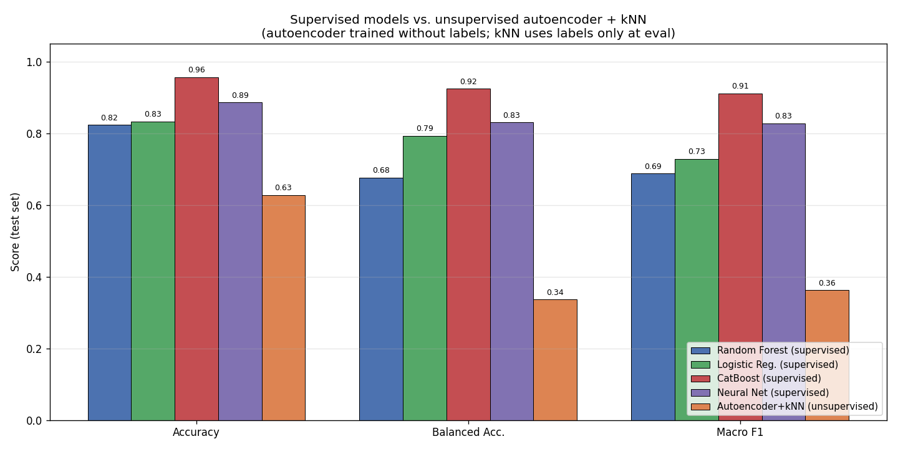

This final comparison puts all four supervised models alongside the **autoencoder + kNN** pipeline, where the neural network learned representations without ever seeing the label and a simple k-NN vote is then used at evaluation to predict `buyer_profile`. This is the cleanest way to ask "how much of the signal is in the *label*, and how much is visible from the features alone?"

- **The autoencoder + kNN reaches only 36% macro F1 and 34% balanced accuracy** — a 55-point gap below CatBoost. The pipeline rides the majority class (62.7% raw accuracy) but cannot separate minority profiles.
- **The autoencoder's latent KMeans scores ARI = 0.052 and NMI = 0.080** (see its section above): clusters carved out by reconstruction-driven geometry barely agree with true buyer profiles.
- **Practical implication**: on this dataset any serious predictive work must use the labels. Unsupervised methods remain useful for *diagnostic* purposes (finding outliers, sanity-checking features, pretraining on an unlabeled pool) but are not a substitute for supervision.

### Cost vs. Benefit: Which Model Should We Actually Use?

| Criterion | Random Forest | Logistic Reg. | CatBoost | Neural Net | Autoencoder + kNN | KMeans |
|---|---|---|---|---|---|---|
| **Test macro F1** | 0.687 | 0.729 | **0.911** | 0.827 | 0.363 | — |
| **Training time** | ~30 s | ~5 s | ~15 s | ~2 min (CPU) | ~40 s (CPU) | ~10 s |
| **Prediction cost** | fast | fastest | fast | fast | fast (encode + kNN) | fast |
| **Interpretability** | medium (feature importance) | **high** (coefficients) | medium (SHAP) | low (black box) | low | low |
| **Handles 250+ categorical levels?** | via one-hot only | via one-hot only | **natively** | via embeddings | via embeddings | via one-hot only |
| **Needs hyperparameter tuning?** | moderate | low | moderate | **high** | moderate | low (just k) |
| **Needs labels to train?** | yes | yes | yes | yes | **no** | **no** |
| **Deployment complexity** | joblib pickle | joblib pickle | joblib/cbm | PyTorch weights + preprocessor | PyTorch weights + preprocessor + kNN index | joblib pickle |

**Recommendation**: **CatBoost is the production model**. It wins on accuracy, stability, and native categorical handling while being cheap to train and deploy. The Neural Network is a useful second opinion — its entity embeddings could become valuable if the dataset grows beyond 10K rows, where gradient boosting's advantage tends to shrink. Logistic Regression remains valuable as an **interpretable baseline** to explain feature contributions to stakeholders. The unsupervised models are best understood as **exploratory tools**. KMeans tested whether raw-feature geometry encodes buyer-profile identity, and the Autoencoder tested whether a *learned* geometry would do any better. Both agree that the label carries information the features alone cannot surface.

---

## How to Run Phase 2

### Training Individual Models

```bash
# Random Forest
python -m src.property_buyer_pipeline.train_random_forest

# Logistic Regression
python -m src.property_buyer_pipeline.train_linear

# CatBoost
python -m src.property_buyer_pipeline.train_catboost

# Neural Network
python -m src.ml.neural_net.train_neural_net

# Autoencoder (unsupervised neural network)
python -m src.ml.autoencoder_buyer.train_autoencoder

# Neural Network with custom parameters
python -m src.ml.neural_net.train_neural_net --epochs 300 --patience 15 --dropout 0.4
```

### Generating Visualizations

```bash
# Neural Network visualizations
python -m src.ml.neural_net.visualize

# Autoencoder (latent space + reconstruction loss)
python -m src.ml.autoencoder_buyer.visualize

# All other model visualizations (RF, LR, CatBoost)
python -m src.ml.generate_all_visualizations

# KMeans-specific visualizations
python -m src.ml.generate_kmeans_viz

# Cross-model comparison plots (used in the Discussion section)
python -m src.ml.generate_comparison_viz
```

All outputs are saved to `visualizations/ml/{algorithm_name}/`.
